# Business Flow Tahun Pertama AI Shop Marketplace

## Fokus Revisi: Marketplace Jasa Universal

### Status Dokumen
Dokumen ini adalah revisi dari business flow tahun pertama yang sebelumnya berfokus pada jasa freelance. Pada versi ini, fokus diperluas menjadi **Marketplace Jasa Universal**.

Istilah freelance tetap dipakai, tetapi tidak lagi menjadi payung utama. Freelance menjadi salah satu bagian dari jasa digital dan jasa profesional. Platform diarahkan untuk menampung berbagai jenis jasa, termasuk jasa digital, jasa fisik datang ke lokasi, jasa perawatan, jasa profesional, dan jasa project custom.

Dokumen ini membahas flow bisnis, pengalaman pengguna, kategori jasa, struktur order, peran AI, pembayaran, escrow, wallet, withdraw, dispute, admin, dan roadmap tahun pertama. Dokumen ini bukan dokumen coding. Dokumen ini tidak membahas database, API, framework, struktur tabel, atau detail teknis pemrograman.

---

# 1. Ringkasan Arah Bisnis Tahun Pertama

Pada tahun pertama, platform sebaiknya tidak diposisikan hanya sebagai marketplace freelance teknologi. Platform perlu diposisikan sebagai marketplace jasa yang lebih luas.

Namun, kategori yang dibuka tetap harus bertahap. Tujuannya agar sistem tidak terlalu berat pada awal validasi bisnis.

Arah tahun pertama:

1. Platform menjadi marketplace jasa berbasis AI.
2. User bisa mencari jasa melalui search manual atau percakapan dengan AI.
3. Penyedia jasa bisa membuat profil dan listing layanan.
4. AI membantu user memilih kategori jasa yang tepat.
5. AI membantu user menyusun kebutuhan, brief, jadwal, atau permintaan penawaran.
6. Order dibuat berdasarkan scope, harga, jadwal, dan bukti kerja yang jelas.
7. Pembayaran dilakukan melalui platform.
8. Dana ditahan dalam status escrow bisnis sampai order selesai.
9. Penyedia jasa mengerjakan layanan sesuai flow jenis jasa.
10. User bisa menyetujui hasil, meminta revisi, meminta perbaikan, atau membuka komplain.
11. Dana masuk ke wallet penyedia setelah order selesai.
12. Penyedia bisa mengajukan withdraw.
13. Admin menangani verifikasi, dispute, risiko, dan withdraw.
14. AI membantu transaksi dan admin, tetapi tidak mengambil keputusan dana besar secara mandiri.

## 1.1 Perubahan Utama dari Versi Sebelumnya

| Bagian | Versi Sebelumnya | Versi Revisi |
|---|---|---|
| Payung bisnis | Jasa freelance | Marketplace jasa universal |
| Fokus kategori | Dominan jasa digital | Digital, fisik, perawatan, profesional, custom project |
| Flow jasa | Satu flow jasa umum | Empat tipe flow jasa |
| Brief order | Brief kerja digital | Brief, lokasi, jadwal, durasi, survey, bukti hadir, acceptance criteria |
| Verifikasi penyedia | Umum | Bertingkat sesuai risiko kategori |
| Dispute | Berdasarkan hasil kerja | Berdasarkan bukti digital, bukti lokasi, bukti hadir, foto sebelum-sesudah, atau scope project |
| Roadmap | Freelance dahulu | Universal system, limited category launch |

## 1.2 Prinsip Strategis Tahun Pertama

Prinsip utama dokumen ini adalah:

> Bangun sistem jasa yang universal, tetapi buka kategori secara bertahap.

Artinya, sejak awal platform perlu menyiapkan struktur yang bisa menampung banyak jenis jasa. Namun, saat launch awal, platform tidak perlu membuka semua kategori.

Pendekatan ini lebih aman karena:

1. Sistem tetap siap berkembang.
2. Tim tidak perlu mengubah konsep besar saat menambah kategori baru.
3. Risiko operasional tetap terkendali.
4. User tidak bingung dengan terlalu banyak pilihan.
5. Admin bisa belajar menangani transaksi secara bertahap.

---

# 2. Posisi Bisnis: Marketplace Jasa Universal

## 2.1 Definisi Marketplace Jasa Universal

Marketplace jasa universal adalah platform yang mempertemukan user dengan penyedia jasa dalam berbagai bentuk layanan. Layanan dapat dilakukan secara digital, datang ke lokasi, berbasis perawatan orang, berbasis konsultasi profesional, atau berbasis project custom.

Contoh jasa yang dapat masuk ke platform:

1. Pembuatan website.
2. Desain UI/UX.
3. Desain grafis.
4. Editing video.
5. Social media management.
6. Service AC.
7. Cleaning service.
8. Tukang bangunan ringan.
9. Teknisi listrik.
10. Babysitter.
11. Caregiver lansia.
12. Tutor privat.
13. Konsultan pajak.
14. Penerjemah.
15. Legal drafting.
16. Renovasi kecil.
17. Project sistem custom.

## 2.2 Kenapa Tidak Memakai Istilah Freelance sebagai Payung Utama

Istilah freelance cocok untuk pekerjaan mandiri seperti desain, website, penulisan, editing, konsultasi, atau pekerjaan digital. Namun, istilah ini kurang tepat untuk jasa fisik dan jasa perawatan.

Contoh:

1. Service AC lebih tepat disebut jasa teknisi.
2. Cleaning service lebih tepat disebut jasa fisik datang ke lokasi.
3. Babysitter lebih tepat disebut jasa perawatan anak.
4. Tukang lebih tepat disebut jasa pekerjaan lapangan.
5. Pembuatan website bisa masuk jasa digital atau project custom.

Karena itu, istilah utama yang lebih tepat adalah **Jasa**. Istilah freelance tetap digunakan sebagai label untuk penyedia jasa tertentu.

## 2.3 Struktur Payung Bisnis

```text
AI Shop Marketplace
└── Marketplace Jasa Universal
    ├── Jasa Digital
    ├── Jasa Fisik / On-Site Service
    ├── Jasa Perawatan / Care Service
    ├── Jasa Profesional
    └── Jasa Custom Project
```

---

# 3. Jenis Jasa Utama

## 3.1 Jasa Digital

Jasa digital adalah layanan yang hasilnya dapat dikirim secara online.

Contoh:

1. Pembuatan website.
2. UI/UX design.
3. Frontend development.
4. Backend development.
5. Fullstack development.
6. WordPress development.
7. Desain grafis.
8. Desain logo.
9. Editing video.
10. Copywriting.
11. Penulisan artikel.
12. Social media management.
13. Admin marketplace.
14. Data entry.
15. Virtual assistant.

Ciri utama:

1. Memakai brief kerja.
2. Memiliki output digital.
3. Memiliki deadline.
4. Memiliki revisi.
5. Memiliki file hasil.
6. Dispute bisa memakai chat, brief, file, dan acceptance criteria.

## 3.2 Jasa Fisik atau On-Site Service

Jasa fisik adalah layanan yang membutuhkan penyedia datang ke lokasi user.

Contoh:

1. Service AC.
2. Cleaning service.
3. Tukang bangunan ringan.
4. Teknisi listrik.
5. Teknisi pipa.
6. Service mesin cuci.
7. Service kulkas.
8. Service elektronik ringan.
9. Jasa pindahan ringan.
10. Montir panggilan.
11. Jasa salon atau grooming panggilan.

Ciri utama:

1. Memakai lokasi.
2. Memakai jadwal.
3. Memakai durasi kerja.
4. Memerlukan bukti hadir.
5. Memerlukan bukti sebelum dan sesudah.
6. Bisa memiliki biaya tambahan di lokasi.
7. Dispute sering terjadi karena hasil, waktu hadir, biaya tambahan, atau kerusakan.

## 3.3 Jasa Perawatan atau Care Service

Jasa perawatan adalah layanan yang berhubungan dengan manusia dan membutuhkan trust lebih tinggi.

Contoh:

1. Babysitter.
2. Caregiver lansia.
3. Perawat homecare.
4. Pendamping pasien.
5. Tutor privat datang ke rumah.
6. Pendamping anak berkebutuhan khusus, jika platform sudah siap SOP dan verifikasi khusus.

Ciri utama:

1. Verifikasi penyedia harus lebih ketat.
2. User perlu memberikan detail kebutuhan.
3. Jadwal harus jelas.
4. Kontak darurat harus tersedia.
5. Batas tugas harus tertulis.
6. Rating dan riwayat kerja menjadi sangat penting.
7. Admin perlu menangani kategori ini lebih hati-hati.

Catatan penting:

Untuk tahun pertama, jasa perawatan sebaiknya tidak dibuka terlalu awal. Kategori ini bisa masuk setelah platform punya sistem verifikasi, rating, bukti kerja, dispute, dan admin review yang cukup kuat.

## 3.4 Jasa Profesional

Jasa profesional adalah layanan berbasis keahlian khusus.

Contoh:

1. Konsultan pajak.
2. Konsultan bisnis.
3. Akuntansi.
4. Legal drafting.
5. Penerjemah tersumpah.
6. Konsultan HR.
7. Konsultan pendidikan.
8. Tutor online.
9. Konsultan karier.

Ciri utama:

1. Membutuhkan profil kredensial.
2. Bisa berbentuk konsultasi online atau offline.
3. Bisa memakai booking jadwal.
4. Output bisa berupa dokumen, laporan, sesi konsultasi, atau rekomendasi.
5. Dispute harus mengacu pada scope layanan, bukan hasil keputusan user setelah konsultasi.

## 3.5 Jasa Custom Project

Jasa custom project adalah layanan yang tidak cocok langsung dibeli sebagai paket biasa karena kebutuhannya harus dianalisis terlebih dahulu.

Contoh:

1. Web app custom.
2. Sistem informasi bisnis.
3. Renovasi kecil.
4. Desain interior sederhana.
5. Event organizer kecil.
6. Paket branding usaha.
7. Project maintenance bulanan.

Ciri utama:

1. Membutuhkan konsultasi awal.
2. Membutuhkan survey atau analisis kebutuhan.
3. Harga belum tentu langsung tetap.
4. Bisa memakai quotation.
5. Bisa memakai DP.
6. Bisa memakai milestone.
7. Perlu acceptance criteria yang lebih kuat.

---

# 4. Struktur Kategori Universal

## 4.1 Prinsip Struktur Kategori

Kategori tidak boleh dibuat terlalu datar. Jika semua kategori ditaruh di level utama, user akan sulit memilih. Struktur kategori perlu bertingkat.

Struktur yang disarankan:

```text
Jenis Jasa
└── Kategori Utama
    └── Subkategori
        └── Spesialisasi
            └── Tipe Order
                └── Paket Layanan
```

Penjelasan:

| Level | Fungsi |
|---|---|
| Jenis Jasa | Menentukan flow dasar transaksi. |
| Kategori Utama | Mengelompokkan bidang jasa besar. |
| Subkategori | Memperjelas jenis pekerjaan. |
| Spesialisasi | Memecah kemampuan teknis atau layanan spesifik. |
| Tipe Order | Menentukan cara order, seperti paket, booking, quotation, atau milestone. |
| Paket Layanan | Menentukan harga, scope, deadline, revisi, atau durasi. |

## 4.2 Contoh Struktur Jasa Digital

```text
Jasa Digital
├── Teknologi
│   ├── Pembuatan Website
│   │   ├── UI/UX Design
│   │   ├── Frontend Development
│   │   ├── Backend Development
│   │   ├── Fullstack Development
│   │   ├── WordPress Development
│   │   ├── Landing Page
│   │   ├── Company Profile
│   │   ├── E-Commerce
│   │   ├── Dashboard Admin
│   │   ├── Web Maintenance
│   │   └── Deployment / Hosting Setup
│   ├── Mobile App
│   ├── Automation
│   ├── Data Entry
│   └── QA Testing
├── Desain
│   ├── Logo
│   ├── Poster
│   ├── Feed Instagram
│   ├── Branding Kit
│   └── UI Design
├── Konten
│   ├── Copywriting
│   ├── Artikel SEO
│   ├── Script Video
│   ├── Caption Media Sosial
│   └── Editing Naskah
└── Multimedia
    ├── Editing Video
    ├── Motion Graphic
    ├── Voice Over
    ├── Desain Thumbnail
    └── Animasi Sederhana
```

## 4.3 Contoh Struktur Jasa Fisik

```text
Jasa Fisik / On-Site Service
├── Rumah Tangga
│   ├── Service AC
│   │   ├── Cuci AC
│   │   ├── Tambah Freon
│   │   ├── Bongkar Pasang AC
│   │   ├── AC Tidak Dingin
│   │   └── Perawatan Berkala
│   ├── Cleaning Service
│   │   ├── General Cleaning
│   │   ├── Deep Cleaning
│   │   ├── Sofa Cleaning
│   │   ├── Kamar Mandi
│   │   └── Rumah Kosong
│   ├── Tukang
│   │   ├── Perbaikan Ringan
│   │   ├── Cat Dinding
│   │   ├── Pasang Rak
│   │   └── Perbaikan Pintu
│   ├── Listrik
│   ├── Pipa
│   └── Service Mesin Cuci
├── Otomotif
│   ├── Montir Panggilan
│   ├── Cuci Mobil Panggilan
│   └── Ganti Oli Panggilan
└── Kecantikan dan Perawatan
    ├── MUA Panggilan
    ├── Hair Stylist Panggilan
    └── Nail Service Panggilan
```

## 4.4 Contoh Struktur Jasa Perawatan

```text
Jasa Perawatan / Care Service
├── Anak
│   ├── Babysitter Harian
│   ├── Babysitter Mingguan
│   ├── Babysitter Bulanan
│   ├── Part Time Babysitter
│   └── Live In Babysitter
├── Lansia
│   ├── Caregiver Harian
│   ├── Caregiver Bulanan
│   └── Pendamping Lansia
├── Pasien
│   ├── Pendamping Pasien
│   ├── Perawat Homecare
│   └── Perawatan Pasca Operasi
└── Pendidikan
    ├── Tutor Privat Online
    ├── Tutor Privat Datang ke Rumah
    └── Pendamping Belajar Anak
```

## 4.5 Contoh Struktur Jasa Profesional

```text
Jasa Profesional
├── Bisnis
│   ├── Konsultan Bisnis
│   ├── Business Plan
│   ├── Riset Pasar
│   └── Pitch Deck
├── Keuangan dan Pajak
│   ├── Konsultan Pajak
│   ├── Pembukuan UMKM
│   ├── Laporan Keuangan
│   └── Administrasi Keuangan
├── Legal
│   ├── Draft Kontrak
│   ├── Review Perjanjian
│   └── Konsultasi Legal Dasar
└── Bahasa
    ├── Penerjemah
    ├── Proofreading
    ├── Interpreter
    └── Transkrip Dokumen
```

---

# 5. Empat Tipe Flow Jasa

Kategori boleh banyak. Namun, flow bisnis jangan terlalu banyak. Agar sistem tetap rapi, semua jasa dikelompokkan ke dalam empat tipe flow.

```text
Tipe Flow Jasa
├── Digital Delivery
├── On-Site Service
├── Care Service
└── Custom Quotation
```

## 5.1 Digital Delivery

Digital Delivery dipakai untuk jasa yang hasilnya dikirim secara online.

Cocok untuk:

1. Website.
2. UI/UX.
3. Desain.
4. Artikel.
5. Editing video.
6. Copywriting.
7. Data entry.
8. Admin online.

Field utama:

| Field | Keterangan |
|---|---|
| Brief | Kebutuhan user. |
| Output | File atau hasil yang harus dikirim. |
| Deadline | Batas waktu pengerjaan. |
| Revisi | Jumlah revisi yang termasuk paket. |
| Referensi | Contoh, link, style, atau bahan dari user. |
| Acceptance criteria | Syarat hasil dianggap selesai. |

## 5.2 On-Site Service

On-Site Service dipakai untuk jasa yang dilakukan di lokasi user.

Cocok untuk:

1. Service AC.
2. Cleaning service.
3. Tukang.
4. Teknisi listrik.
5. Teknisi pipa.
6. Montir panggilan.
7. MUA panggilan.

Field utama:

| Field | Keterangan |
|---|---|
| Lokasi | Alamat layanan. |
| Jadwal | Tanggal dan jam kedatangan. |
| Durasi | Estimasi lama pengerjaan. |
| Detail masalah | Keluhan atau kebutuhan user. |
| Foto awal | Bukti kondisi sebelum pekerjaan. |
| Foto akhir | Bukti kondisi setelah pekerjaan. |
| Biaya tambahan | Sparepart, material, parkir, atau transport jika berlaku. |

## 5.3 Care Service

Care Service dipakai untuk jasa yang berhubungan dengan keselamatan, kenyamanan, dan perawatan orang.

Cocok untuk:

1. Babysitter.
2. Caregiver lansia.
3. Perawat homecare.
4. Pendamping pasien.
5. Tutor datang ke rumah.

Field utama:

| Field | Keterangan |
|---|---|
| Profil yang dirawat | Usia, kondisi umum, kebutuhan dasar. |
| Jadwal | Jam kerja dan periode layanan. |
| Lokasi | Tempat layanan. |
| Tugas utama | Batas pekerjaan yang disepakati. |
| Batas tugas | Hal yang tidak termasuk layanan. |
| Kontak darurat | Nomor keluarga atau penanggung jawab. |
| Verifikasi penyedia | Identitas, pengalaman, referensi kerja. |

## 5.4 Custom Quotation

Custom Quotation dipakai untuk jasa yang perlu ditawar atau dihitung terlebih dahulu.

Cocok untuk:

1. Web app custom.
2. Renovasi kecil.
3. Project sistem.
4. Desain interior.
5. Branding package.
6. Event kecil.
7. Maintenance bulanan.

Field utama:

| Field | Keterangan |
|---|---|
| Kebutuhan awal | Ringkasan kebutuhan user. |
| Budget estimasi | Kisaran dana user jika ada. |
| Survey | Perlu atau tidak perlu survey. |
| Quotation | Penawaran dari penyedia. |
| DP | Uang muka jika disepakati. |
| Milestone | Tahapan pekerjaan. |
| Final approval | Persetujuan hasil akhir. |

---

# 6. Flow Besar Marketplace Jasa Universal

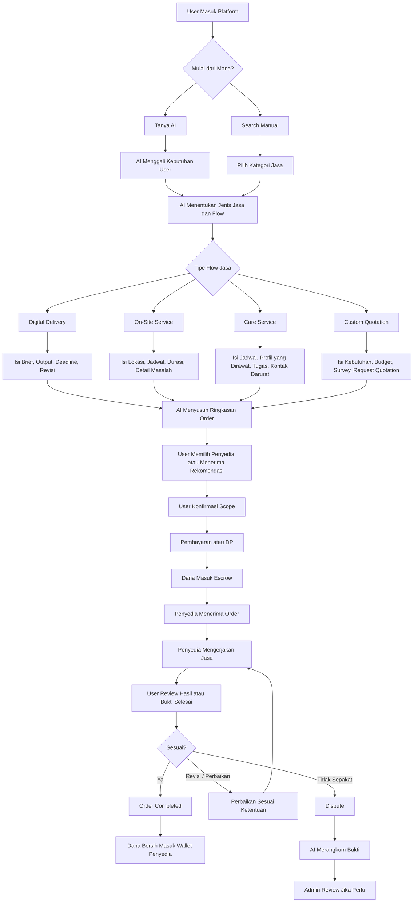

---

# 7. Role Pengguna

## 7.1 Role Utama

| Role | Fungsi |
|---|---|
| User / Pemesan | Mencari jasa, membuat order, membayar, memberi rating, membuka komplain. |
| Penyedia Jasa | Membuat profil, membuat listing, menerima order, mengerjakan jasa, menerima saldo. |
| Freelancer Digital | Penyedia jasa digital seperti desain, website, konten, editing. |
| Teknisi / Petugas Lapangan | Penyedia jasa fisik seperti AC, cleaning, listrik, tukang. |
| Care Provider | Penyedia jasa perawatan seperti babysitter atau caregiver. |
| Profesional | Penyedia jasa berbasis keahlian khusus. |
| Admin | Verifikasi, moderasi, dispute, risiko, dan withdraw. |
| AI Transaction Agent | Membantu pencarian, brief, order, rekomendasi, ringkasan bukti, dan monitoring. |

## 7.2 Prinsip Multi-Role

Satu akun bisa memiliki lebih dari satu role.

Contoh:

1. User bisa menjadi pemesan dan penyedia jasa digital.
2. Penyedia jasa digital bisa juga membeli jasa dari penyedia lain.
3. Admin tidak boleh memakai hak admin untuk transaksi pribadi.

---

# 8. Aktivasi Penyedia dan Verifikasi

## 8.1 Prinsip Verifikasi Bertingkat

Tidak semua kategori memerlukan verifikasi yang sama. Jasa digital sederhana tidak perlu verifikasi seketat babysitter atau caregiver.

Struktur verifikasi:

| Level | Cocok Untuk | Data Minimal |
|---|---|---|
| Basic Verification | Jasa digital risiko rendah | Nama, kontak, rekening, portofolio. |
| Standard Verification | Jasa fisik dan profesional umum | Identitas, rekening, alamat, foto profil, pengalaman. |
| Enhanced Verification | Babysitter, caregiver, homecare, jasa masuk rumah | Identitas, alamat, referensi kerja, pengalaman, kontak darurat, admin review. |
| Business Verification | Agency atau perusahaan jasa | Dokumen usaha, PIC, rekening bisnis, alamat usaha. |

## 8.2 Flow Aktivasi Penyedia

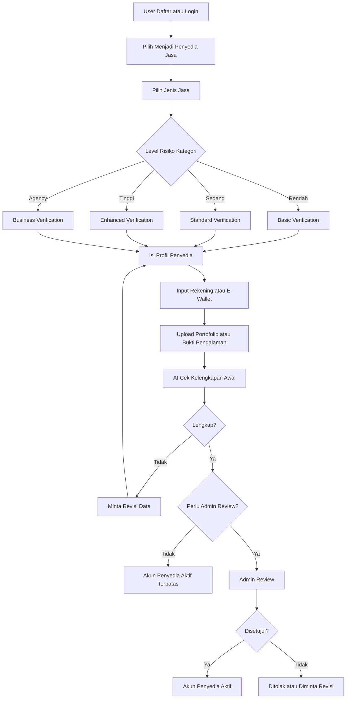

## 8.3 Status Penyedia

| Status | Makna |
|---|---|
| Draft | Penyedia belum melengkapi profil. |
| Submitted | Data sudah diajukan. |
| Pending Review | Menunggu review admin. |
| Active Limited | Aktif terbatas untuk kategori risiko rendah. |
| Active Verified | Aktif penuh. |
| Revision Needed | Data harus diperbaiki. |
| Rejected | Aktivasi ditolak. |
| Suspended | Penyedia ditahan karena risiko atau pelanggaran. |

---

# 9. Listing Jasa

## 9.1 Definisi Listing Jasa

Listing jasa adalah halaman penawaran layanan dari penyedia. Listing harus menjelaskan apa yang dikerjakan, harga, durasi, scope, batasan layanan, dan syarat hasil dianggap selesai.

## 9.2 Data Listing Universal

| Data | Wajib? | Catatan |
|---|---:|---|
| Nama layanan | Ya | Harus jelas dan spesifik. |
| Kategori | Ya | Mengikuti struktur kategori universal. |
| Tipe flow | Ya | Digital, on-site, care, atau custom quotation. |
| Deskripsi layanan | Ya | Menjelaskan manfaat dan proses. |
| Harga dasar | Ya | Bisa fixed, per jam, per hari, per unit, atau mulai dari. |
| Estimasi waktu | Ya | Deadline, durasi, atau jadwal. |
| Scope pekerjaan | Ya | Apa saja yang termasuk layanan. |
| Batasan layanan | Ya | Apa saja yang tidak termasuk. |
| Revisi atau perbaikan | Sesuai tipe jasa | Wajib untuk digital, opsional untuk fisik. |
| Portofolio atau bukti pengalaman | Disarankan | Meningkatkan trust. |
| Syarat tambahan | Sesuai kategori | Contoh alat, sparepart, lokasi, kontak darurat. |

## 9.3 Flow Membuat Listing

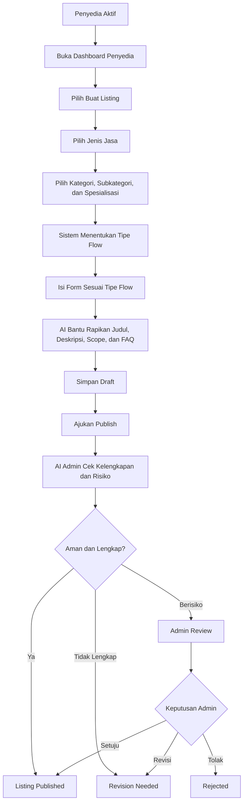

## 9.4 Status Listing

| Status | Makna |
|---|---|
| Draft | Listing masih disusun. |
| Submitted | Listing diajukan. |
| Pending Review | Menunggu pengecekan. |
| Published | Listing tampil di marketplace. |
| Revision Needed | Listing perlu diperbaiki. |
| Rejected | Listing ditolak. |
| Suspended | Listing ditahan. |
| Archived | Listing tidak aktif. |

---

# 10. Model Paket Layanan

## 10.1 Fixed Package

Fixed Package adalah paket dengan harga dan scope tetap.

Cocok untuk:

1. Desain logo.
2. Landing page.
3. Artikel SEO.
4. Cuci AC per unit.
5. General cleaning ukuran kecil.

Contoh:

```text
Nama Paket: Landing Page Basic
Harga: Rp750.000
Deadline: 5 hari
Revisi: 2 kali
Output: 1 halaman landing page responsive
Tidak termasuk: Copywriting panjang, hosting, domain, integrasi payment
```

## 10.2 Hourly, Daily, atau Shift Package

Paket ini berbasis waktu.

Cocok untuk:

1. Babysitter harian.
2. Caregiver.
3. Tutor privat.
4. Cleaning service per jam.
5. Virtual assistant.

Contoh:

```text
Nama Paket: Babysitter Harian
Harga: Rp250.000 per 8 jam
Jadwal: 08.00 sampai 16.00
Tugas: Menjaga anak, memberi makan, menemani bermain
Tidak termasuk: Pekerjaan rumah berat, memasak keluarga, menginap
```

## 10.3 Per Unit Package

Paket ini berbasis jumlah unit.

Cocok untuk:

1. Cuci AC per unit.
2. Cleaning sofa per seat.
3. Desain feed per post.
4. Input data per jumlah data.

Contoh:

```text
Nama Paket: Cuci AC Split
Harga: Rp75.000 per unit
Durasi: 45 sampai 60 menit per unit
Termasuk: Cuci indoor dan outdoor standar
Tidak termasuk: Sparepart dan isi freon
```

## 10.4 Custom Quotation

Custom Quotation digunakan saat harga belum bisa ditentukan sebelum detail kebutuhan jelas.

Cocok untuk:

1. Web app custom.
2. Renovasi.
3. Project branding.
4. Maintenance bulanan.

Contoh:

```text
Nama Layanan: Pembuatan Web App Custom
Harga: Mulai dari Rp3.000.000
Tahap: Konsultasi, quotation, DP, milestone, final delivery
Output: Sesuai scope yang disetujui
```

## 10.5 Milestone Package

Milestone Package digunakan untuk pekerjaan yang panjang.

Cocok untuk:

1. Fullstack web development.
2. Sistem informasi.
3. Renovasi kecil.
4. Branding package.

Contoh milestone:

| Milestone | Output | Persentase Dana |
|---|---|---:|
| 1 | Wireframe dan UI awal | 20% |
| 2 | Frontend selesai | 30% |
| 3 | Backend dan integrasi | 30% |
| 4 | Testing dan final delivery | 20% |

---

# 11. Detail Khusus Pembuatan Website

## 11.1 Kenapa Website Perlu Dipecah

Pembuatan website tidak boleh hanya menjadi satu kategori umum. Di dalamnya ada banyak pekerjaan berbeda. Ada desain, frontend, backend, fullstack, deployment, maintenance, dan testing.

Jika semua digabung, user sulit memilih penyedia yang tepat. Penyedia juga sulit menjelaskan scope.

## 11.2 Struktur Kategori Website

```text
Jasa Digital
└── Teknologi
    └── Pembuatan Website
        ├── Landing Page
        ├── Company Profile
        ├── Toko Online
        ├── Dashboard Admin
        ├── Web App Custom
        ├── Blog / Portal Berita
        ├── LMS / E-Learning
        ├── WordPress Website
        ├── Website Maintenance
        └── Deployment / Hosting Setup
```

## 11.3 Struktur Role Teknis Website

```text
Role Teknis Website
├── UI/UX Designer
├── Frontend Developer
├── Backend Developer
├── Fullstack Developer
├── WordPress Developer
├── No-Code Developer
├── QA Tester
├── DevOps / Deployment
└── Maintenance Support
```

## 11.4 Cara Platform Menentukan Flow Website

| Kebutuhan User | Flow yang Cocok | Catatan |
|---|---|---|
| Butuh desain tampilan saja | Digital Delivery | Output Figma atau desain UI. |
| Butuh landing page sederhana | Digital Delivery | Bisa fixed package. |
| Butuh company profile | Digital Delivery | Bisa fixed package. |
| Butuh dashboard admin | Custom Quotation | Perlu scope fitur. |
| Butuh marketplace | Custom Quotation | Perlu analisis besar. |
| Butuh backend API | Custom Quotation | Perlu detail fitur dan integrasi. |
| Butuh maintenance bulanan | Subscription / Custom Quotation | Perlu SLA. |
| Butuh deploy hosting | Digital Delivery | Bisa fixed package jika sederhana. |

## 11.5 Contoh Listing Website

```text
Kategori: Jasa Digital
Subkategori: Teknologi
Layanan: Pembuatan Website
Spesialisasi: Landing Page
Role: UI/UX + Frontend
Tipe Flow: Digital Delivery
Paket: Standard
Harga: Rp750.000
Deadline: 5 hari
Revisi: 2 kali
Output: Desain Figma + HTML/CSS/React responsive
Acceptance Criteria:
1. Tampilan sesuai brief utama.
2. Responsive untuk mobile dan desktop.
3. Semua section sesuai daftar yang disepakati.
4. Revisi hanya untuk perubahan minor.
```

## 11.6 Flow Order Website

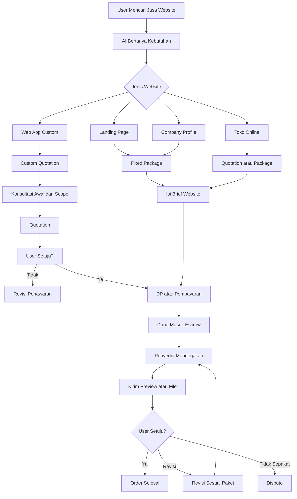

---

# 12. Flow Digital Delivery

## 12.1 Alur Utama

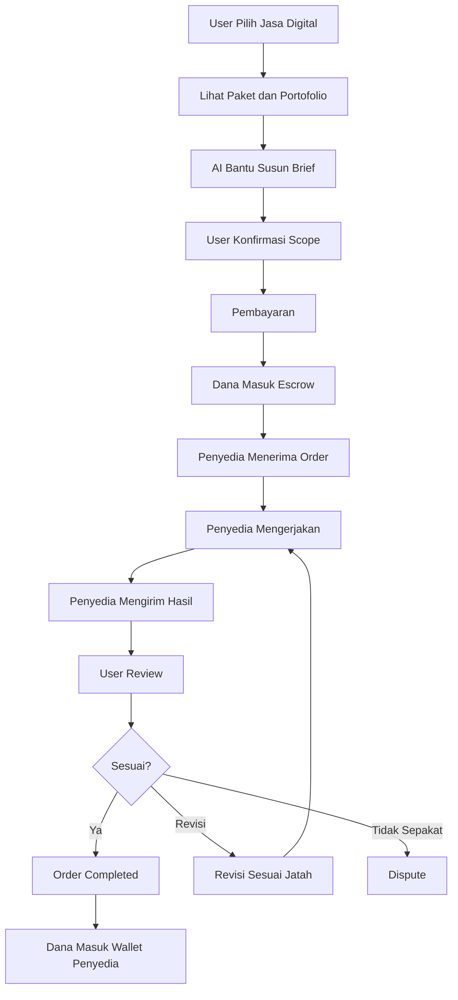

## 12.2 Data Order Digital

| Data | Contoh |
|---|---|
| Judul kebutuhan | Buat landing page produk skincare. |
| Tujuan | Promosi dan konversi WhatsApp. |
| Referensi | Link website contoh. |
| Bahan dari user | Logo, foto produk, copywriting. |
| Output | Figma, HTML, React, PDF, MP4, artikel. |
| Deadline | 5 hari. |
| Revisi | 2 kali. |
| Acceptance criteria | Responsive, 5 section, CTA WhatsApp aktif. |

## 12.3 Aturan Revisi Digital

| Kondisi | Aksi |
|---|---|
| Revisi sesuai brief awal | Masuk jatah revisi. |
| Revisi di luar brief awal | Bisa jadi biaya tambahan. |
| User meminta perubahan besar | Buat add-on order. |
| Penyedia telat tanpa alasan | User bisa buka komplain. |
| File tidak bisa dibuka | Penyedia wajib kirim ulang. |

---

# 13. Flow On-Site Service

## 13.1 Alur Utama

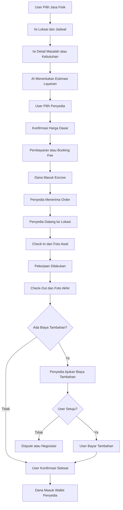

## 13.2 Data Order On-Site

| Data | Contoh |
|---|---|
| Lokasi | Alamat rumah, kantor, apartemen. |
| Jadwal | 15 Juni 2026, pukul 10.00. |
| Detail masalah | AC tidak dingin, 2 unit. |
| Foto awal | Foto AC atau area kerja. |
| Estimasi durasi | 1 sampai 2 jam. |
| Harga dasar | Rp75.000 per unit. |
| Biaya tambahan | Sparepart, freon, material, parkir. |
| Bukti selesai | Foto atau video setelah pengerjaan. |

## 13.3 Aturan Biaya Tambahan

Biaya tambahan harus jelas dan tidak boleh sepihak.

Aturan yang disarankan:

1. Penyedia wajib menjelaskan alasan biaya tambahan.
2. Penyedia wajib mengunggah bukti jika ada sparepart atau material.
3. User harus menyetujui biaya tambahan sebelum pekerjaan tambahan dilakukan.
4. Jika user menolak, pekerjaan tambahan tidak dilakukan.
5. Jika terjadi beda pendapat, order bisa masuk dispute.

## 13.4 Contoh Service AC

```text
Kategori: Jasa Fisik
Subkategori: Rumah Tangga
Layanan: Service AC
Spesialisasi: Cuci AC
Tipe Flow: On-Site Service
Harga: Rp75.000 per unit
Unit: 2 AC
Jadwal: 15 Juni 2026, pukul 10.00
Lokasi: Rumah user
Termasuk: Cuci indoor dan outdoor standar
Tidak termasuk: Sparepart, tambah freon, bongkar pasang
Bukti Selesai: Foto sebelum dan sesudah
```

## 13.5 Contoh Cleaning Service

```text
Kategori: Jasa Fisik
Subkategori: Kebersihan
Layanan: Cleaning Service
Spesialisasi: Deep Cleaning
Tipe Flow: On-Site Service
Harga: Rp250.000
Durasi: 3 jam
Petugas: 2 orang
Lokasi: Apartemen user
Termasuk: Ruang tamu, kamar, dapur, kamar mandi
Tidak termasuk: Cuci karpet, cuci sofa, pindah barang berat
Bukti Selesai: Foto area sebelum dan sesudah
```

---

# 14. Flow Care Service

## 14.1 Catatan Penamaan

Untuk kategori seperti babysitter, caregiver, dan perawat homecare, sebaiknya platform memakai istilah **pesan jasa** atau **booking jasa**, bukan **sewa orang**.

Istilah yang lebih aman:

1. Pesan babysitter.
2. Booking caregiver.
3. Pesan perawat homecare.
4. Booking tutor privat.

## 14.2 Alur Utama

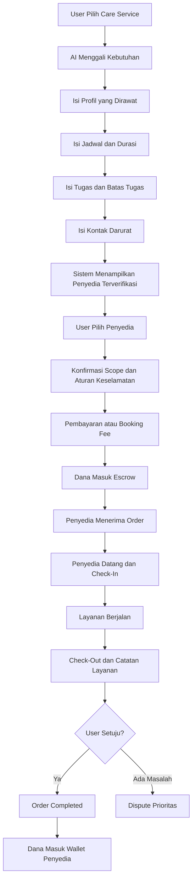

## 14.3 Data Order Care Service

| Data | Contoh |
|---|---|
| Jenis layanan | Babysitter harian. |
| Usia anak / profil pengguna layanan | Anak 2 tahun. |
| Jadwal | Senin sampai Jumat, 08.00 sampai 16.00. |
| Lokasi | Rumah user. |
| Tugas utama | Menjaga, memberi makan, menemani bermain. |
| Batas tugas | Tidak termasuk memasak keluarga dan pekerjaan rumah berat. |
| Kontak darurat | Nomor orang tua atau keluarga. |
| Catatan khusus | Alergi, rutinitas makan, jam tidur. |

## 14.4 Verifikasi Care Provider

Verifikasi wajib lebih kuat karena penyedia akan masuk ke ruang pribadi user atau merawat orang.

Data yang disarankan:

1. Identitas resmi.
2. Foto profil jelas.
3. Nomor kontak aktif.
4. Alamat domisili.
5. Pengalaman kerja.
6. Referensi kerja jika ada.
7. Sertifikat jika tersedia.
8. Wawancara admin untuk kategori tertentu.
9. Rekening atas nama sendiri.

## 14.5 Batasan Tahun Pertama untuk Care Service

Care Service tidak disarankan masuk pada launch awal. Kategori ini bisa masuk pada semester kedua atau setelah sistem berikut siap:

1. Verifikasi bertingkat.
2. Rating dan review.
3. Riwayat order.
4. Admin review.
5. SOP komplain prioritas.
6. Bukti check-in dan check-out.
7. Kontak darurat.
8. Kebijakan keamanan user dan penyedia.

---

# 15. Flow Custom Quotation

## 15.1 Alur Utama

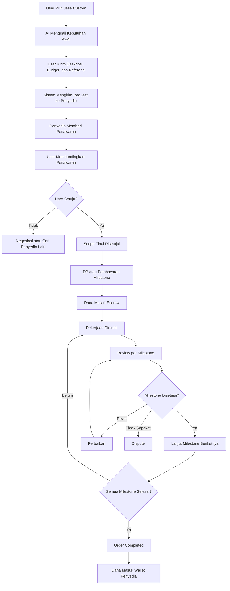

## 15.2 Data Request Quotation

| Data | Contoh |
|---|---|
| Kebutuhan | Buat web app booking service AC. |
| Tujuan | User bisa pesan teknisi dan bayar online. |
| Budget | Rp5.000.000 sampai Rp10.000.000. |
| Deadline | 30 hari. |
| Referensi | Link aplikasi sejenis. |
| Fitur wajib | Login, booking, payment, dashboard admin. |
| Fitur opsional | Rating, chat, voucher. |
| Output | Source code, deployment, dokumentasi sederhana. |

## 15.3 Aturan Quotation

1. Penawaran harus punya scope yang jelas.
2. Harga harus memisahkan pekerjaan utama dan add-on.
3. Timeline harus realistis.
4. DP harus masuk escrow.
5. Milestone harus punya output yang bisa diperiksa.
6. Perubahan scope harus dibuat sebagai add-on atau order baru.

---

# 16. AI Transaction Agent

## 16.1 Peran AI untuk User

AI membantu user dari awal sampai akhir transaksi.

Fungsi AI:

1. Menggali kebutuhan user.
2. Menentukan kategori jasa yang tepat.
3. Menentukan tipe flow jasa.
4. Menyusun brief digital.
5. Menyusun detail lokasi dan jadwal untuk jasa fisik.
6. Menyusun scope babysitter, caregiver, atau tutor.
7. Menyusun request quotation.
8. Merekomendasikan penyedia yang sesuai.
9. Membandingkan harga, rating, lokasi, deadline, dan pengalaman.
10. Membuat ringkasan order sebelum user membayar.
11. Memberi reminder status order.
12. Membantu membuka komplain.
13. Merangkum bukti dispute.

## 16.2 Peran AI untuk Penyedia

AI membantu penyedia membuat listing lebih rapi.

Fungsi AI:

1. Membantu membuat judul layanan.
2. Membantu menulis deskripsi.
3. Membantu menyusun paket harga.
4. Membantu menyusun batasan layanan.
5. Membantu membuat FAQ.
6. Membantu membuat respon chat awal.
7. Membantu membaca brief user.
8. Membantu membuat quotation awal.
9. Membantu membuat laporan hasil kerja.

## 16.3 Peran AI untuk Admin

AI membantu admin, tetapi tidak menggantikan keputusan manusia untuk kasus berisiko.

Fungsi AI:

1. Mengecek kelengkapan verifikasi.
2. Menandai listing tidak lengkap.
3. Menandai kategori berisiko.
4. Merangkum dispute.
5. Membandingkan bukti user dan penyedia.
6. Memberi rekomendasi refund atau release dana.
7. Menandai withdraw berisiko.
8. Menandai pola transaksi mencurigakan.

## 16.4 Batas Aman AI

| Aktivitas | AI Boleh? | Catatan |
|---|---:|---|
| Menentukan kategori jasa | Ya | Berdasarkan jawaban user. |
| Membuat draft brief | Ya | User harus konfirmasi. |
| Membuat draft order | Ya | User harus konfirmasi. |
| Merekomendasikan penyedia | Ya | Gunakan data rating, harga, lokasi, dan relevansi. |
| Menyetujui refund kecil | Bisa rekomendasi | Admin tetap validasi pada MVP. |
| Menyetujui refund besar | Tidak | Wajib admin. |
| Menahan withdraw mencurigakan | Bisa sementara | Harus ada audit trail. |
| Memblokir permanen akun | Tidak | Wajib admin. |
| Menentukan kesalahan dalam care service | Tidak final | Wajib admin prioritas. |

---

# 17. Order Lifecycle Universal

## 17.1 Status Order

| Status | Makna |
|---|---|
| Draft | Order masih disusun. |
| Pending Confirmation | Menunggu konfirmasi user. |
| Pending Payment | Menunggu pembayaran. |
| Payment Failed | Pembayaran gagal. |
| Paid | Pembayaran berhasil. |
| Escrow Hold | Dana ditahan dalam status escrow bisnis. |
| Waiting Provider Acceptance | Menunggu penyedia menerima order. |
| Accepted | Penyedia menerima order. |
| Scheduled | Khusus jasa terjadwal. |
| In Progress | Jasa sedang dikerjakan. |
| Submitted / Service Done | Hasil dikirim atau layanan selesai. |
| Waiting User Review | Menunggu user menyetujui. |
| Revision Requested | User meminta revisi. |
| Additional Fee Requested | Ada biaya tambahan yang diajukan. |
| Disputed | Ada komplain. |
| Completed | Order selesai. |
| Refunded | Dana dikembalikan. |
| Partially Refunded | Dana dikembalikan sebagian. |
| Cancelled | Order dibatalkan. |
| Settled | Dana bersih masuk wallet penyedia. |

## 17.2 Flow Status Order

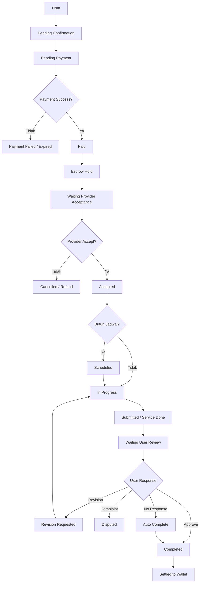

---

# 18. Payment, Escrow, Wallet, dan Withdraw

## 18.1 Prinsip Dana

Platform memakai escrow sebagai status bisnis dana aman. Dana tidak langsung diberikan kepada penyedia setelah user membayar. Dana dilepas setelah order selesai, auto-complete, atau keputusan dispute.

## 18.2 Model Pembayaran Berdasarkan Tipe Jasa

| Tipe Jasa | Model Pembayaran Disarankan |
|---|---|
| Digital Delivery | Full payment di awal ke escrow. |
| On-Site Service | Full payment atau booking fee di awal. |
| Care Service | Booking fee, harian, mingguan, atau bulanan sesuai policy. |
| Custom Quotation | DP, milestone, atau full payment sesuai nilai project. |

## 18.3 Flow Dana

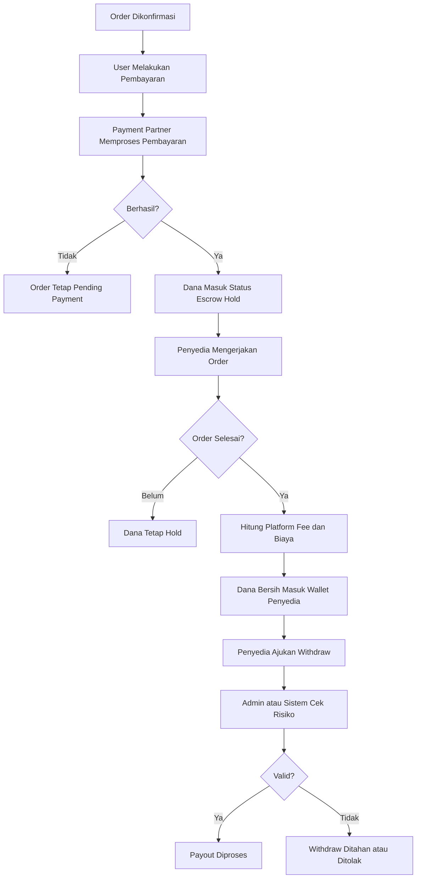

## 18.4 Komisi dan Biaya

| Komponen | Rekomendasi Awal |
|---|---|
| Platform fee jasa digital | 5% sampai 10%. |
| Platform fee jasa fisik | 5% sampai 8%. |
| Platform fee care service | 5% sampai 10%, perlu legal review. |
| Platform fee custom project | 5% sampai 10% per milestone. |
| Service fee user | Bisa dipakai untuk menutup payment gateway fee. |
| Withdraw fee | Ditanggung penyedia jika melewati free withdraw. |
| Biaya tambahan on-site | Harus disetujui user sebelum dikerjakan. |

## 18.5 Aturan Withdraw

1. Minimum withdraw disarankan Rp50.000 atau Rp100.000.
2. Withdraw akun baru bisa diberi holding period 3 sampai 7 hari.
3. Withdraw hanya boleh ke rekening atau e-wallet terverifikasi.
4. Withdraw berisiko bisa ditahan untuk review admin.
5. Transfer saldo antar-user tidak diperbolehkan.
6. Wallet hanya untuk settlement penyedia, bukan dompet bebas pakai.

---

# 19. Dispute dan Komplain

## 19.1 Prinsip Dispute

Dispute harus berbasis bukti. Setiap tipe jasa memiliki bukti yang berbeda.

| Tipe Jasa | Bukti Utama |
|---|---|
| Digital Delivery | Brief, chat, file hasil, revisi, acceptance criteria. |
| On-Site Service | Lokasi, jadwal, check-in, foto awal, foto akhir, bukti biaya tambahan. |
| Care Service | Jadwal, check-in, check-out, catatan layanan, kontak darurat, laporan user. |
| Custom Quotation | Scope, quotation, milestone, bukti progres, approval per tahap. |

## 19.2 Flow Dispute

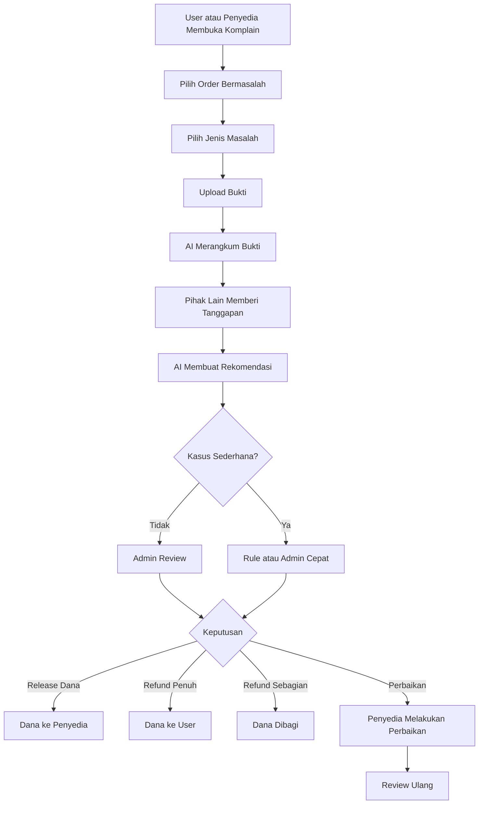

## 19.3 Jenis Masalah Umum

| Tipe Jasa | Masalah Umum |
|---|---|
| Digital | Hasil tidak sesuai brief, file tidak dikirim, deadline telat, revisi tidak dikerjakan. |
| Fisik | Penyedia tidak datang, datang terlambat, hasil tidak sesuai, biaya tambahan tidak disetujui. |
| Care | Penyedia tidak datang, tugas tidak sesuai, perilaku tidak profesional, jadwal tidak dipenuhi. |
| Custom | Scope berubah, milestone tidak selesai, output tidak sesuai, timeline molor. |

## 19.4 Keputusan Dispute

Keputusan yang bisa diambil:

1. Dana dilepas ke penyedia.
2. Refund penuh ke user.
3. Refund sebagian.
4. Penyedia wajib memperbaiki pekerjaan.
5. Order dibatalkan.
6. Penyedia diberi peringatan.
7. Akun ditahan sementara jika ada risiko.
8. Kasus dieskalasi ke admin senior untuk kategori berisiko tinggi.

---

# 20. Rating, Review, dan Trust Score

## 20.1 Rating Setelah Order Selesai

User memberi rating setelah order completed.

Komponen rating:

1. Kualitas hasil.
2. Ketepatan waktu.
3. Komunikasi.
4. Profesionalitas.
5. Kesesuaian dengan scope.
6. Untuk jasa fisik: kebersihan dan kerapian kerja.
7. Untuk care service: kedisiplinan, empati, dan keamanan.

## 20.2 Trust Score Penyedia

Trust score membantu AI dan user memilih penyedia.

Komponen trust score:

| Komponen | Dampak |
|---|---|
| Rating rata-rata | Meningkatkan kepercayaan. |
| Jumlah order selesai | Menunjukkan pengalaman. |
| Rasio dispute | Menunjukkan risiko. |
| Ketepatan waktu | Penting untuk semua jasa. |
| Response time | Mempengaruhi rekomendasi AI. |
| Verifikasi | Meningkatkan prioritas kategori berisiko. |
| Repeat order | Menunjukkan kepuasan user. |

---

# 21. Admin Platform

## 21.1 Fungsi Admin

Admin menjadi pengendali operasional dan risiko.

Fungsi admin:

1. Verifikasi penyedia.
2. Review listing.
3. Kelola kategori.
4. Pantau order.
5. Tangani dispute.
6. Review withdraw.
7. Tahan transaksi berisiko.
8. Kelola laporan user.
9. Kelola policy kategori.
10. Review rekomendasi AI.

## 21.2 Dashboard Admin yang Dibutuhkan

| Menu Admin | Fungsi |
|---|---|
| Provider Verification | Review data penyedia. |
| Listing Moderation | Review listing jasa. |
| Order Monitoring | Melihat status order. |
| Dispute Center | Menangani komplain. |
| Withdraw Review | Menyetujui atau menolak withdraw. |
| Risk Flag | Melihat transaksi mencurigakan. |
| Category Management | Menambah dan merapikan kategori. |
| Policy Management | Mengatur rule kategori. |
| Report Center | Laporan transaksi, user, dan penyedia. |

---

# 22. Risk Control Tahun Pertama

## 22.1 Risiko Utama

| Risiko | Contoh | Mitigasi |
|---|---|---|
| Penyedia palsu | Portofolio palsu, rekening tidak valid | Verifikasi rekening dan review profil. |
| Order fiktif | Buyer dan penyedia saling transaksi palsu | Risk flag IP, device, rekening, pola transaksi. |
| Gestun atau pencairan palsu | Order cepat selesai lalu withdraw | Holding period dan review withdraw. |
| Dispute subjektif | User tidak suka hasil padahal sesuai brief | Acceptance criteria sejak awal. |
| Penyedia tidak datang | On-site gagal hadir | Penalti, bukti check-in, refund. |
| Biaya tambahan sepihak | Teknisi meminta biaya di luar aplikasi | Biaya tambahan harus disetujui di aplikasi. |
| Risiko care service | Masalah keselamatan atau perilaku | Verifikasi tinggi dan admin review prioritas. |

## 22.2 Risk Flag Dasar

Sistem perlu memberi tanda risiko pada kondisi berikut:

1. Akun baru langsung membuat transaksi besar.
2. Order selesai terlalu cepat tanpa bukti.
3. Withdraw langsung diajukan setelah saldo masuk.
4. Banyak transaksi antar dua akun yang sama.
5. Banyak akun memakai rekening yang sama.
6. Bukti kerja kosong atau tidak relevan.
7. Banyak dispute pada penyedia yang sama.
8. Penyedia on-site sering terlambat atau no-show.

---

# 23. Roadmap Tahun Pertama

## 23.1 Prinsip Roadmap

Roadmap tahun pertama harus membuka kategori secara bertahap. Sistem boleh universal sejak awal. Launch kategori tetap harus terbatas.

## 23.2 Roadmap Per Kuartal

| Periode | Fokus | Kategori yang Dibuka | Catatan |
|---|---|---|---|
| Q1 | Fondasi marketplace jasa | Jasa digital sederhana | Validasi order, payment, escrow, wallet, withdraw manual. |
| Q2 | Perluasan jasa digital | Website, desain, konten, admin online | Tambah brief AI, revisi, dispute dasar. |
| Q3 | Masuk jasa fisik ringan | Service AC, cleaning, teknisi ringan | Tambah lokasi, jadwal, check-in, foto sebelum-sesudah. |
| Q4 | Custom project dan care terbatas | Web custom, maintenance, tutor, babysitter pilot terbatas | Wajib enhanced verification dan admin review. |

## 23.3 Tahap MVP Awal

MVP awal sebaiknya fokus pada jasa digital yang paling mudah divalidasi.

Kategori MVP awal:

1. Desain grafis.
2. Pembuatan landing page.
3. UI/UX design.
4. Copywriting.
5. Artikel SEO.
6. Editing video ringan.
7. Admin online.
8. Data entry.

Fitur MVP awal:

1. Register dan login.
2. Aktivasi penyedia jasa.
3. Basic verification.
4. Buat listing jasa.
5. Search dan kategori jasa.
6. AI bantu pilih kategori.
7. AI bantu susun brief.
8. Order jasa.
9. Pembayaran melalui platform.
10. Escrow bisnis sederhana.
11. Pengiriman hasil kerja.
12. Revisi.
13. Konfirmasi selesai.
14. Wallet penyedia.
15. Withdraw manual.
16. Dispute dasar.
17. Rating dan review.

## 23.4 Yang Ditunda dari MVP Awal

1. Babysitter full scale.
2. Caregiver full scale.
3. Perawat homecare.
4. Rental barang.
5. Deposit kompleks.
6. Paylater.
7. Refund otomatis penuh.
8. Payout otomatis penuh tanpa review.
9. Multi-milestone kompleks.
10. Transfer saldo antar-user.
11. Penalti otomatis permanen.

---

# 24. Policy yang Perlu Disiapkan

Agar marketplace jasa universal berjalan aman, platform perlu menyiapkan policy berikut:

1. Syarat dan ketentuan pengguna.
2. Kebijakan penyedia jasa.
3. Kebijakan kategori jasa digital.
4. Kebijakan jasa fisik datang ke lokasi.
5. Kebijakan care service.
6. Kebijakan custom project.
7. Kebijakan pembayaran.
8. Kebijakan escrow bisnis.
9. Kebijakan refund.
10. Kebijakan biaya tambahan on-site.
11. Kebijakan revisi digital.
12. Kebijakan no-show penyedia.
13. Kebijakan pembatalan user.
14. Kebijakan wallet.
15. Kebijakan withdraw.
16. Kebijakan dispute.
17. Kebijakan rating dan review.
18. Kebijakan verifikasi penyedia.
19. Kebijakan penggunaan AI.
20. Kebijakan fraud dan transaksi fiktif.
21. Kebijakan keamanan untuk jasa masuk rumah.
22. Kebijakan privasi data user.

---

# 25. Rekomendasi Struktur Menu Tahun Pertama

## 25.1 Menu User

```text
Home
Cari Jasa
Tanya AI
Kategori Jasa
Order Saya
Chat
Komplain
Wallet / Pembayaran
Profil
```

## 25.2 Menu Penyedia

```text
Dashboard Penyedia
Profil Penyedia
Verifikasi
Listing Jasa
Order Masuk
Jadwal Saya
Chat Order
Penghasilan
Withdraw
Rating dan Review
```

## 25.3 Menu Admin

```text
Dashboard Admin
Verifikasi Penyedia
Moderasi Listing
Kategori Jasa
Order Monitoring
Dispute Center
Withdraw Review
Risk Flag
Laporan Transaksi
Policy Management
```

---

# 26. Kesimpulan Revisi

Fokus tahun pertama sebaiknya tidak lagi disebut marketplace freelance saja. Arah yang lebih tepat adalah **Marketplace Jasa Universal**.

Namun, strategi peluncurannya tetap bertahap. Sistem perlu dibuat universal sejak awal, tetapi kategori yang dibuka tidak boleh terlalu banyak pada fase awal.

Rekomendasi akhir:

1. Gunakan istilah utama **Marketplace Jasa Universal**.
2. Jadikan freelance sebagai bagian dari jasa digital dan jasa profesional.
3. Kelompokkan semua jasa ke dalam empat tipe flow: Digital Delivery, On-Site Service, Care Service, dan Custom Quotation.
4. Gunakan struktur kategori bertingkat agar kategori bisa luas tanpa membingungkan user.
5. Pecah pembuatan website menjadi kebutuhan, role teknis, dan paket layanan.
6. Buka jasa digital terlebih dahulu pada MVP awal.
7. Masukkan jasa fisik setelah order, escrow, wallet, rating, dan dispute dasar stabil.
8. Masukkan care service seperti babysitter setelah verifikasi dan SOP keamanan lebih siap.
9. Gunakan AI sebagai transaction agent, bukan pengambil keputusan dana besar.
10. Gunakan admin manusia untuk dispute kompleks, care service, refund besar, dan withdraw berisiko.

Dengan revisi ini, platform tetap punya arah besar yang luas. Namun, eksekusi tahun pertama tetap realistis, mudah dipahami, dan aman untuk divalidasi.
