# Flow Visual AI Shop Marketplace

Dokumen ini menjelaskan **alur utama platform AI Shop Marketplace** secara visual menggunakan diagram Mermaid.  
Fokus dokumen ini adalah **flow bisnis dan pengalaman pengguna**, bukan coding, database, atau teknis pemrograman.

Platform yang direncanakan bukan hanya untuk jual-beli barang, tetapi juga untuk:

1. Jualan produk.
2. Freelance atau jasa.
3. Sewa/rental barang atau layanan.
4. Pembayaran melalui platform.
5. Dana ditahan sementara sampai transaksi aman.
6. Saldo masuk ke penjual/freelancer/pemilik sewa.
7. Withdraw atau pencairan uang.
8. Bantuan AI untuk mencari, memilih, membuat pesanan, dan membantu transaksi.

---

## 1. Gambaran Besar Platform

Flow besar platform ini dapat dipahami seperti ini:

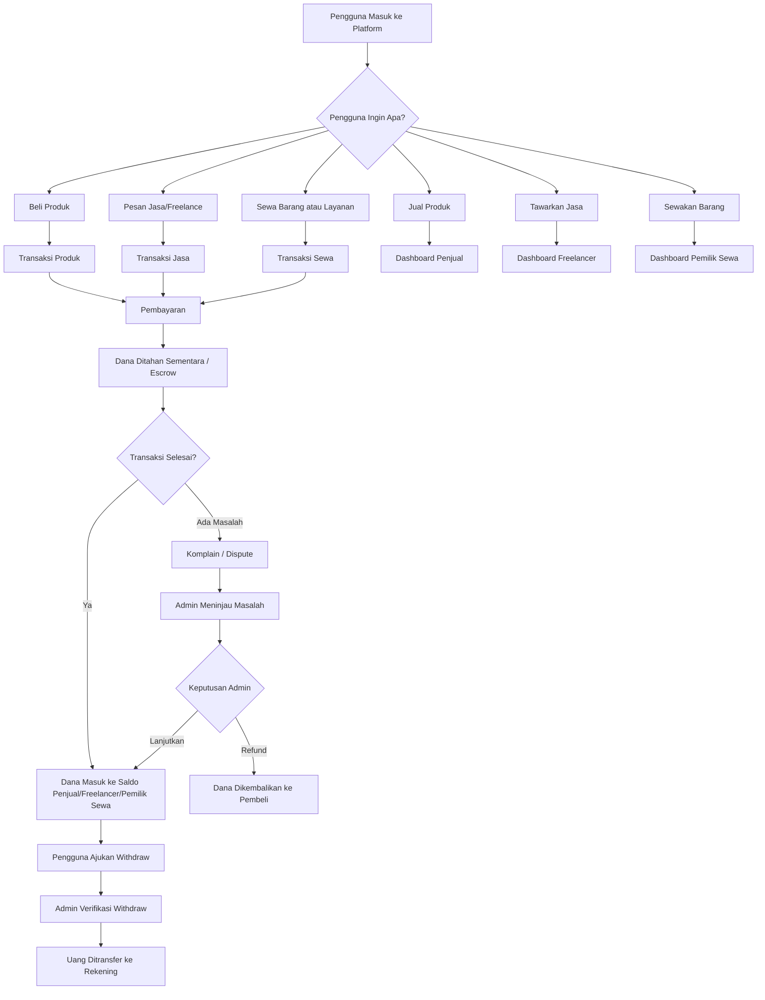

### Penjelasan Sederhana

Platform ini bekerja seperti pusat transaksi. Pembeli bisa membeli produk, memesan jasa, atau menyewa barang. Setelah pembeli membayar, uang tidak langsung diberikan ke penjual. Uang ditahan dulu oleh sistem sampai transaksi selesai dengan aman. Setelah transaksi selesai, dana masuk ke saldo pihak penyedia. Setelah itu, penyedia bisa mengajukan withdraw.

---

## 2. Role Pengguna dalam Platform

Di dalam platform ini ada beberapa jenis pengguna.

```mermaid
flowchart TD
    A[User / Pengguna] --> B[Buyer / Pembeli]
    A --> C[Seller / Penjual Produk]
    A --> D[Freelancer / Penyedia Jasa]
    A --> E[Rental Owner / Pemilik Barang Sewa]
    A --> F[Admin Platform]

    B --> B1[Mencari produk, jasa, atau sewa]
    B --> B2[Membayar transaksi]
    B --> B3[Memberi rating dan ulasan]

    C --> C1[Upload produk]
    C --> C2[Menerima pesanan]
    C --> C3[Mendapat saldo setelah transaksi selesai]

    D --> D1[Upload layanan jasa]
    D --> D2[Mengerjakan pesanan]
    D --> D3[Mengirim hasil kerja]

    E --> E1[Upload barang sewa]
    E --> E2[Mengelola jadwal sewa]
    E --> E3[Menerima pengembalian barang]

    F --> F1[Memantau pengguna]
    F --> F2[Memantau transaksi]
    F --> F3[Menyelesaikan komplain]
    F --> F4[Menyetujui withdraw]
```

### Penjelasan Sederhana

Satu akun pengguna bisa memiliki beberapa fungsi. Misalnya, seseorang bisa menjadi pembeli sekaligus penjual. Namun, untuk keamanan, fitur menjual, menawarkan jasa, menyewakan barang, dan withdraw sebaiknya membutuhkan verifikasi tambahan.

---

## 3. Flow Utama untuk Pembeli

Pembeli adalah pengguna yang ingin membeli produk, memesan jasa, atau menyewa barang.

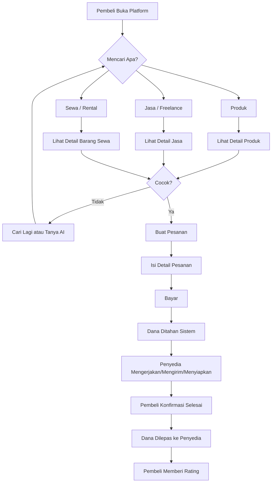

### Penjelasan Sederhana

Pembeli tidak harus bingung memilih. Jika belum tahu produk, jasa, atau sewa yang cocok, pembeli bisa bertanya kepada AI. AI membantu memberikan rekomendasi, membandingkan pilihan, dan mengarahkan pembeli ke transaksi yang sesuai.

---

## 4. Flow Jual-Beli Produk

Flow ini digunakan ketika pengguna membeli barang fisik atau produk digital.

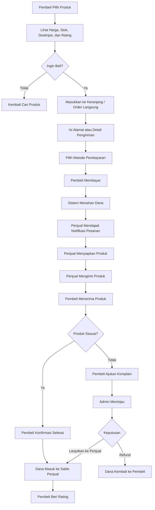

### Contoh Kasus

Pembeli membeli headset seharga Rp150.000. Setelah pembayaran berhasil, dana belum langsung masuk ke penjual. Penjual mengirim barang. Setelah pembeli menerima barang dan menekan tombol selesai, dana baru masuk ke saldo penjual.

---

## 5. Flow Freelance / Jasa

Flow ini digunakan untuk layanan seperti desain logo, edit video, pembuatan website, penulisan artikel, admin sosial media, dan jasa lainnya.

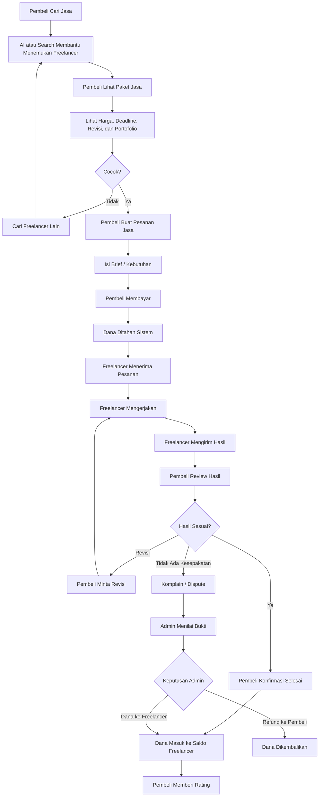

### Penjelasan Sederhana

Freelance berbeda dengan jual produk karena yang dikirim bukan barang, tetapi hasil kerja. Karena itu, perlu ada brief, deadline, revisi, file hasil kerja, dan persetujuan pembeli sebelum dana dilepas.

---

## 6. Flow Sewa / Rental

Flow ini digunakan untuk penyewaan barang, tempat, alat, kendaraan, kamera, laptop, ruangan, atau layanan berbasis waktu.

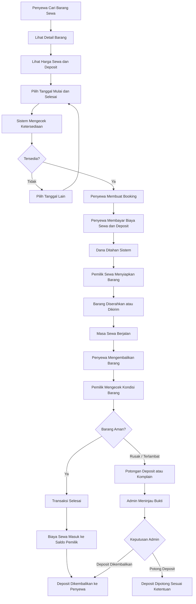

### Penjelasan Sederhana

Sewa membutuhkan kalender ketersediaan, tanggal mulai, tanggal selesai, deposit, bukti kondisi barang, dan aturan jika barang rusak atau terlambat dikembalikan.

---

## 7. Flow AI Assistant

AI Assistant menjadi pembeda utama platform ini. AI tidak hanya menjawab pertanyaan, tetapi membantu pengguna sampai menemukan pilihan yang tepat.

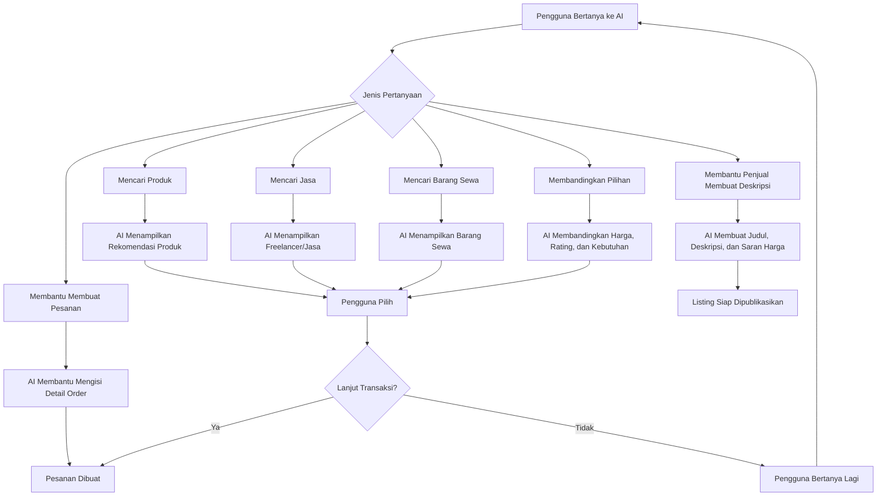

### Contoh Pertanyaan ke AI

- “Aku butuh desain logo untuk usaha kopi, budget 200 ribu.”
- “Cari laptop bekas untuk desain ringan.”
- “Aku mau sewa kamera untuk 3 hari.”
- “Bandingkan jasa edit video yang murah tapi rating bagus.”
- “Bantu buat deskripsi produk kaos polos.”

---

## 8. Flow Pembayaran dan Escrow

Escrow adalah sistem penahanan dana sementara. Tujuannya agar pembeli dan penyedia sama-sama aman.

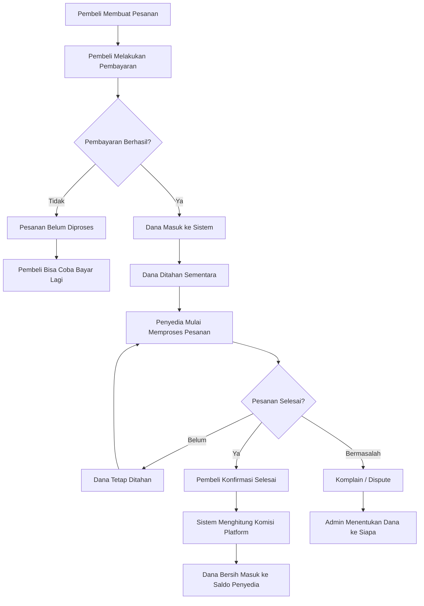

### Penjelasan Sederhana

Pembayaran berhasil tidak berarti uang langsung diberikan ke penjual. Uang ditahan dulu agar jika ada masalah, sistem masih bisa mengatur pengembalian dana atau penyelesaian komplain.

---

## 9. Flow Saldo / Wallet

Saldo adalah tempat uang milik penjual, freelancer, atau pemilik sewa setelah transaksi selesai.

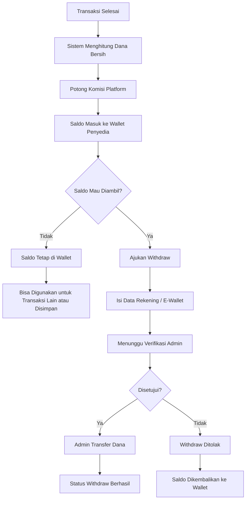

### Penjelasan Sederhana

Saldo tidak boleh hanya berupa angka biasa. Setiap uang masuk dan keluar harus punya riwayat. Ini penting supaya pengguna percaya dan admin bisa mengecek jika terjadi masalah.

---

## 10. Flow Withdraw

Withdraw adalah proses pencairan saldo dari platform ke rekening pengguna.

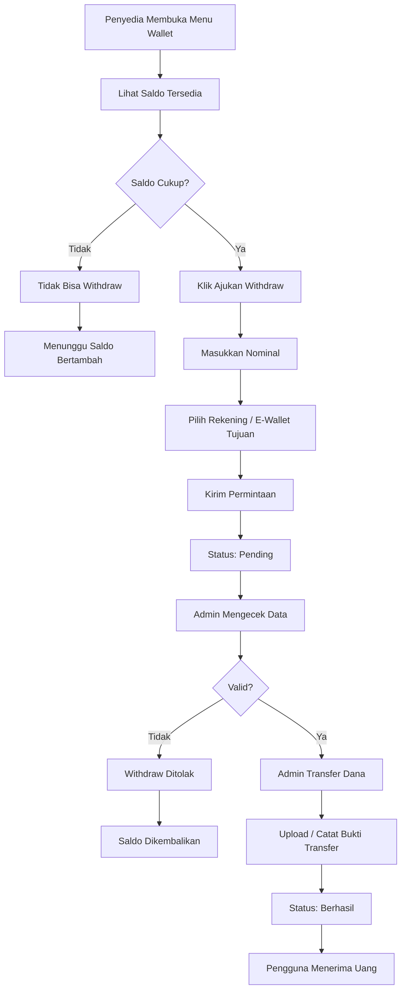

### Hal yang Perlu Diperhatikan

Withdraw harus aman karena berhubungan langsung dengan uang pengguna. Minimal harus ada status pending, approved, rejected, dan paid/berhasil.

---

## 11. Flow Komplain / Dispute

Komplain terjadi ketika pembeli merasa produk, jasa, atau sewa tidak sesuai.

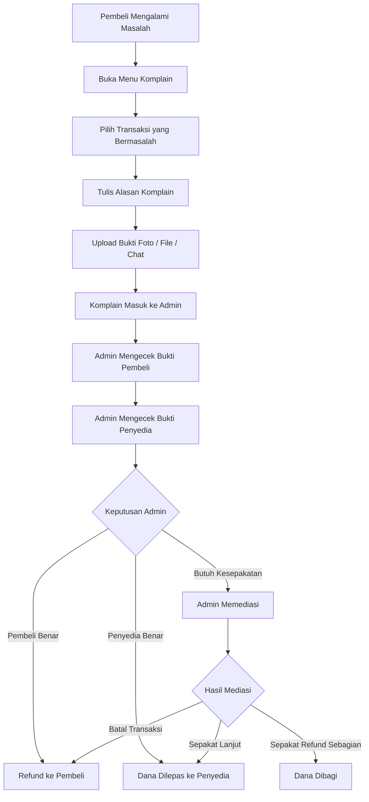

### Penjelasan Sederhana

Dispute adalah fitur penting agar platform terlihat profesional. Tanpa dispute, pembeli takut membayar dan penyedia juga takut tidak dibayar.

---

## 12. Flow Admin Platform

Admin bertugas menjaga keamanan dan kelancaran transaksi.

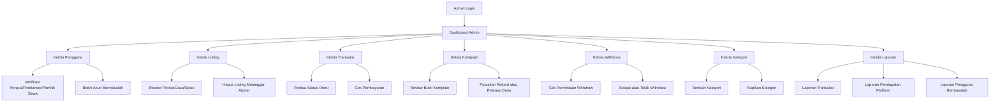

### Penjelasan Sederhana

Admin bukan hanya mengatur produk. Admin juga menjaga agar transaksi tidak kacau, withdraw aman, dan komplain dapat diselesaikan dengan adil.

---

## 13. Flow Penjual Produk

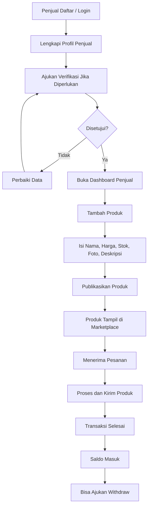

---

## 14. Flow Freelancer

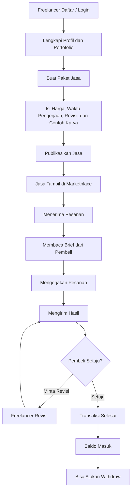

---

## 15. Flow Pemilik Barang Sewa

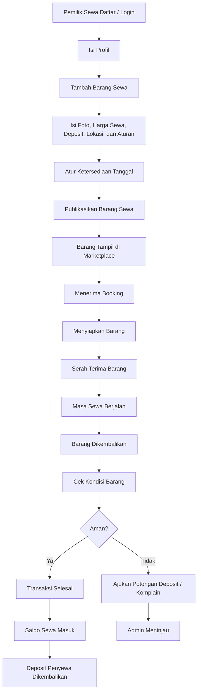

---

## 16. Urutan Pengembangan yang Disarankan

Agar tidak bingung, pengembangan platform sebaiknya tidak langsung dibuat semuanya sekaligus. Urutannya bisa seperti ini:

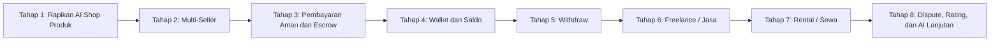

### Penjelasan Prioritas

Tahap pertama jangan langsung mengejar semua fitur. Mulailah dari produk dan multi-seller. Setelah transaksi produk stabil, baru tambah wallet dan withdraw. Setelah sistem uang aman, barulah masuk ke freelance dan rental.

---

## 17. Flow MVP Paling Awal

MVP adalah versi awal yang paling sederhana tetapi sudah bisa digunakan.

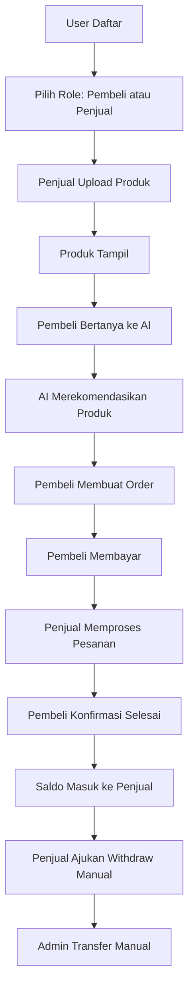

### MVP yang Masuk Akal

Untuk versi awal, fitur yang paling penting adalah:

1. User bisa daftar dan login.
2. Penjual bisa upload produk.
3. Pembeli bisa mencari produk lewat AI.
4. Pembeli bisa membuat pesanan.
5. Pembeli bisa membayar.
6. Dana masuk ke sistem dulu.
7. Penjual menerima saldo setelah transaksi selesai.
8. Withdraw bisa diajukan dan diproses admin secara manual.

---

## 18. Flow Versi Lengkap Setelah Dikembangkan

```mermaid
flowchart TD
    A[AI Shop Marketplace] --> B[Produk]
    A --> C[Jasa / Freelance]
    A --> D[Sewa / Rental]
    A --> E[AI Assistant]
    A --> F[Wallet dan Withdraw]
    A --> G[Admin Control]

    B --> B1[Beli Produk]
    B --> B2[Jual Produk]
    B --> B3[Pengiriman]
    B --> B4[Rating Produk]

    C --> C1[Pesan Jasa]
    C --> C2[Tawarkan Jasa]
    C --> C3[Brief dan Revisi]
    C --> C4[Delivery File]

    D --> D1[Sewa Barang]
    D --> D2[Sewakan Barang]
    D --> D3[Kalender Sewa]
    D --> D4[Deposit dan Pengembalian]

    E --> E1[Rekomendasi Produk]
    E --> E2[Rekomendasi Jasa]
    E --> E3[Rekomendasi Sewa]
    E --> E4[Bantu Buat Listing]
    E --> E5[Bantu Buat Order]

    F --> F1[Saldo Pending]
    F --> F2[Saldo Tersedia]
    F --> F3[Withdraw]
    F --> F4[Riwayat Mutasi]

    G --> G1[Verifikasi User]
    G --> G2[Moderasi Listing]
    G --> G3[Kelola Transaksi]
    G --> G4[Kelola Komplain]
    G --> G5[Setujui Withdraw]
```

---

## 19. Contoh Alur Lengkap dari Awal sampai Withdraw

Contoh: seseorang membeli jasa desain logo.

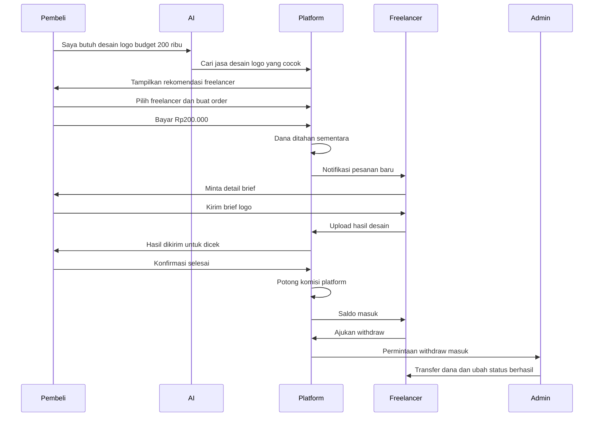

---

## 20. Kesimpulan Flow

Platform ini sebaiknya dibangun dengan prinsip berikut:

1. Pengguna mudah mencari produk, jasa, atau sewa dengan bantuan AI.
2. Pembeli membayar melalui platform agar transaksi aman.
3. Dana ditahan dulu sampai transaksi selesai.
4. Penyedia menerima saldo setelah transaksi dinyatakan selesai.
5. Withdraw dilakukan setelah saldo tersedia.
6. Admin menjadi penjaga keamanan transaksi, komplain, dan pencairan dana.
7. AI menjadi asisten utama, bukan hanya chatbot biasa.

Dengan flow ini, platform tidak hanya menjadi toko online, tetapi berkembang menjadi **AI Marketplace Multi-Layanan** yang bisa melayani jual-beli, freelance, sewa, dan sistem pencairan uang.
