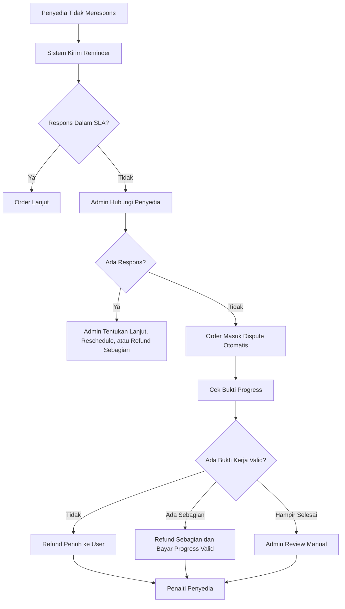
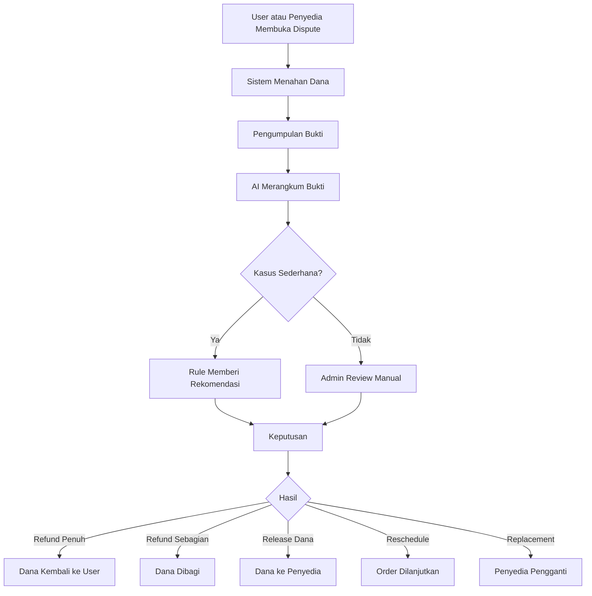

# Kebijakan Marketplace Jasa Universal Tahun Pertama

## Rancangan Berbasis Regulasi Indonesia

### Status Dokumen

Dokumen ini adalah rancangan kebijakan bisnis untuk marketplace jasa universal di Indonesia. Dokumen ini belum menggantikan legal opinion dari advokat, notaris, konsultan pajak, atau konsultan sistem pembayaran.

Dokumen ini dirancang untuk platform yang menyediakan jasa digital, jasa fisik datang ke lokasi, care service, jasa profesional, dan custom project.

Fokus utama dokumen ini adalah:

1. Pembatalan order.
2. Penyedia jasa menghilang atau no-show.
3. User membatalkan setelah pekerjaan berjalan.
4. User membatalkan setelah pekerjaan selesai.
5. Refund penuh dan refund sebagian.
6. Dana ditahan sebagai escrow bisnis.
7. Dispute.
8. Verifikasi penyedia.
9. Keamanan jasa masuk rumah.
10. Perlindungan data pribadi.
11. Batas peran AI.
12. Pencegahan fraud.

---

# 1. Dasar Hukum Utama

## 1.1 Undang-Undang dan Regulasi yang Menjadi Acuan

| No | Regulasi | Relevansi untuk Platform |
|---:|---|---|
| 1 | Undang-Undang Nomor 8 Tahun 1999 tentang Perlindungan Konsumen | Menjadi dasar hak konsumen, kewajiban pelaku usaha, informasi yang benar, kompensasi, ganti rugi, dan penyelesaian sengketa konsumen. |
| 2 | Kitab Undang-Undang Hukum Perdata | Menjadi dasar perjanjian, kesepakatan, wanprestasi, dan tanggung jawab para pihak. |
| 3 | Undang-Undang Nomor 11 Tahun 2008 tentang Informasi dan Transaksi Elektronik beserta perubahannya, termasuk UU Nomor 19 Tahun 2016 dan UU Nomor 1 Tahun 2024 | Menjadi dasar kontrak elektronik, informasi elektronik, dokumen elektronik, dan transaksi elektronik. |
| 4 | Peraturan Pemerintah Nomor 71 Tahun 2019 tentang Penyelenggaraan Sistem dan Transaksi Elektronik | Menjadi dasar kewajiban penyelenggara sistem elektronik, keamanan sistem, keandalan layanan, dan tata kelola transaksi elektronik. |
| 5 | Peraturan Pemerintah Nomor 80 Tahun 2019 tentang Perdagangan Melalui Sistem Elektronik | Menjadi dasar kegiatan perdagangan melalui sistem elektronik, informasi pelaku usaha, informasi barang atau jasa, dan mekanisme transaksi. |
| 6 | Permendag Nomor 31 Tahun 2023 tentang Perizinan Berusaha, Periklanan, Pembinaan, dan Pengawasan Pelaku Usaha dalam PMSE | Menjadi dasar teknis untuk pelaku usaha PMSE, perizinan, periklanan, pembinaan, dan pengawasan. |
| 7 | Undang-Undang Nomor 27 Tahun 2022 tentang Pelindungan Data Pribadi | Menjadi dasar pengumpulan, pemrosesan, penyimpanan, penghapusan, dan keamanan data pribadi user dan penyedia. |
| 8 | Peraturan Pemerintah Nomor 17 Tahun 2025 tentang Tata Kelola Penyelenggaraan Sistem Elektronik dalam Pelindungan Anak | Relevan untuk fitur yang melibatkan anak, data anak, konten anak, atau layanan seperti babysitter. |
| 9 | Undang-Undang Nomor 23 Tahun 2002 tentang Perlindungan Anak sebagaimana diubah dengan UU Nomor 35 Tahun 2014 dan UU Nomor 17 Tahun 2016 | Menjadi dasar keamanan anak dalam layanan care service. |
| 10 | Undang-Undang Nomor 13 Tahun 2003 tentang Ketenagakerjaan beserta perubahan terkait Cipta Kerja | Relevan jika platform mengelola pekerja secara langsung, bukan hanya menjadi perantara marketplace. |
| 11 | Peraturan Bank Indonesia Nomor 10 Tahun 2025 tentang Pengaturan Industri Sistem Pembayaran | Menjadi dasar kehati-hatian jika platform menggunakan payment gateway, payout, dan sistem pembayaran. |

## 1.2 Prinsip Legal yang Harus Dipakai

Platform harus memakai 7 prinsip ini.

| Prinsip | Makna Praktis |
|---|---|
| Transparansi | User dan penyedia harus tahu harga, fee, status dana, scope kerja, batas refund, dan batas dispute. |
| Persetujuan elektronik | Order, revisi, pembatalan, biaya tambahan, dan refund harus dikonfirmasi melalui sistem. |
| Bukti digital | Chat, brief, invoice, bukti hadir, foto, file, dan riwayat status harus disimpan. |
| Perlindungan konsumen | User berhak atas informasi yang benar, layanan yang sesuai, dan mekanisme komplain. |
| Perlindungan penyedia | Penyedia berhak dibayar jika pekerjaan sudah sesuai scope dan bukti selesai valid. |
| Perlindungan data pribadi | Platform hanya boleh memproses data sesuai kebutuhan layanan dan dasar pemrosesan yang sah. |
| Human review | Keputusan dana bernilai besar, dispute kompleks, care service, dan kasus fraud harus ditinjau admin manusia. |

---

# 2. Posisi Hukum Platform

## 2.1 Model yang Disarankan

Model paling aman untuk tahun pertama adalah:

> Platform bertindak sebagai marketplace jasa dan perantara transaksi digital antara user dan penyedia jasa.

Artinya:

1. Platform menyediakan sistem pencarian jasa.
2. Platform menyediakan sistem order.
3. Platform menyediakan payment flow melalui payment partner.
4. Platform menyediakan escrow bisnis sebagai status dana dalam transaksi.
5. Platform menyediakan chat, bukti, dispute, rating, wallet, dan withdraw.
6. Penyedia jasa tetap bertanggung jawab atas layanan yang diberikan.
7. User tetap bertanggung jawab atas data, alamat, instruksi, dan approval yang diberikan.

## 2.2 Istilah yang Sebaiknya Dipakai

Gunakan istilah ini:

| Istilah yang Aman | Hindari Istilah Ini |
|---|---|
| Marketplace jasa | Agen tenaga kerja tanpa izin |
| Pemesanan layanan babysitter | Sewa orang |
| Payment partner | Platform menahan uang sendiri |
| Escrow bisnis | Escrow legal tanpa struktur hukum |
| Wallet settlement penyedia | Uang elektronik bebas transfer |
| Penyedia jasa independen | Pegawai platform, kecuali memang hubungan kerja |
| Biaya tambahan disetujui di aplikasi | Tambahan biaya cash di luar platform |

---

# 3. Klasifikasi Jasa dan Tipe Risiko

## 3.1 Jenis Jasa

| Jenis Jasa | Contoh | Risiko Utama |
|---|---|---|
| Jasa digital | Website, UI/UX, desain, copywriting, video editing | Scope tidak jelas, revisi berulang, user cancel setelah hasil diterima. |
| Jasa fisik on-site | Cleaning, service AC, tukang, teknisi listrik | No-show, biaya tambahan, kerusakan barang, keselamatan lokasi. |
| Care service | Babysitter, caregiver, perawat homecare | Keselamatan anak/lansia, data sensitif, verifikasi ketat, risiko pidana. |
| Jasa profesional | Konsultan pajak, legal, akuntansi, tutor | Kualifikasi, batas tanggung jawab, hasil konsultasi. |
| Custom project | Renovasi kecil, sistem custom, event kecil | Perubahan scope, milestone, DP, pekerjaan berhenti di tengah jalan. |

## 3.2 Tipe Flow

| Tipe Flow | Cocok Untuk | Aturan Kunci |
|---|---|---|
| Digital Delivery | Website, desain, copywriting | Brief, milestone, revisi, file hasil, acceptance criteria. |
| On-Site Service | Tukang, service AC, cleaning | Jadwal, lokasi, check-in, check-out, bukti sebelum-sesudah. |
| Care Service | Babysitter, caregiver | Verifikasi ketat, SOP keamanan, kontak darurat, pembatasan scope. |
| Custom Quotation | Renovasi, sistem custom | Survey, quotation, DP, milestone, addendum perubahan scope. |

---

# 4. Struktur Kebijakan Utama

Platform minimal perlu memiliki 22 kebijakan.

| No | Kebijakan | Tujuan |
|---:|---|---|
| 1 | Syarat dan ketentuan pengguna | Mengatur hubungan umum antara platform, user, dan penyedia. |
| 2 | Kebijakan penyedia jasa | Mengatur kewajiban, larangan, dan standar kerja penyedia. |
| 3 | Kebijakan kategori jasa digital | Mengatur brief, file, revisi, deadline, dan hasil digital. |
| 4 | Kebijakan jasa fisik datang ke lokasi | Mengatur lokasi, jadwal, check-in, biaya tambahan, dan bukti kerja. |
| 5 | Kebijakan care service | Mengatur babysitter, caregiver, keselamatan, verifikasi, dan emergency contact. |
| 6 | Kebijakan custom project | Mengatur survey, quotation, DP, milestone, dan perubahan scope. |
| 7 | Kebijakan pembayaran | Mengatur payment method, invoice, status pembayaran, dan bukti bayar. |
| 8 | Kebijakan escrow bisnis | Mengatur dana hold, release, refund, dan settlement. |
| 9 | Kebijakan refund | Mengatur refund penuh, sebagian, dan tidak refund. |
| 10 | Kebijakan biaya tambahan on-site | Mengatur biaya sparepart, parkir, transport, dan biaya lapangan lain. |
| 11 | Kebijakan revisi digital | Mengatur jumlah revisi, batas revisi, dan revisi berbayar. |
| 12 | Kebijakan no-show penyedia | Mengatur penyedia tidak datang atau tidak merespons. |
| 13 | Kebijakan pembatalan user | Mengatur cancel sebelum mulai, saat berjalan, dan setelah selesai. |
| 14 | Kebijakan wallet | Mengatur saldo penyedia sebagai ledger settlement. |
| 15 | Kebijakan withdraw | Mengatur pencairan ke rekening terverifikasi. |
| 16 | Kebijakan dispute | Mengatur komplain, bukti, mediasi, keputusan, dan banding. |
| 17 | Kebijakan rating dan review | Mengatur ulasan, manipulasi rating, dan review palsu. |
| 18 | Kebijakan verifikasi penyedia | Mengatur KTP, rekening, pengalaman, sertifikat, dan trust score. |
| 19 | Kebijakan penggunaan AI | Mengatur batas AI dalam rekomendasi dan keputusan finansial. |
| 20 | Kebijakan fraud dan transaksi fiktif | Mengatur larangan gestun, wash trading, order palsu, dan kolusi. |
| 21 | Kebijakan keamanan jasa masuk rumah | Mengatur keselamatan user, penyedia, anak, lansia, dan properti. |
| 22 | Kebijakan privasi data user | Mengatur data pribadi, lokasi, KTP, kontak darurat, dan riwayat transaksi. |

---

# 5. Kebijakan Pembatalan User

## 5.1 Prinsip Umum

User boleh membatalkan order. Namun, hak cancel tidak boleh merugikan penyedia yang sudah bekerja sesuai scope.

Platform harus membedakan 5 waktu pembatalan:

1. Cancel sebelum pembayaran.
2. Cancel setelah pembayaran, tetapi sebelum penyedia menerima order.
3. Cancel setelah penyedia menerima order, tetapi sebelum pekerjaan dimulai.
4. Cancel saat pekerjaan berjalan.
5. Cancel setelah pekerjaan selesai atau hasil dikirim.

## 5.2 Matrix Pembatalan User

| Kondisi | Status Dana | Keputusan Default |
|---|---|---|
| Order belum dibayar | Belum ada dana | Order bisa dibatalkan kapan saja. |
| Sudah dibayar, penyedia belum menerima | Dana hold | Refund penuh ke user. |
| Penyedia sudah menerima, pekerjaan belum mulai | Dana hold | Refund penuh atau potong cancellation fee jika ada biaya persiapan valid. |
| Jasa digital sudah mulai dikerjakan | Dana hold | Refund sebagian berdasarkan progress dan bukti kerja. |
| Jasa fisik sudah menuju lokasi | Dana hold | Refund sebagian, biaya transport valid bisa dipotong jika disetujui di kebijakan. |
| Jasa fisik sudah mulai dikerjakan | Dana hold | Refund sebagian sesuai progress dan bukti kerja. |
| Care service sudah dimulai | Dana hold | Refund sebagian sesuai jam kerja berjalan. |
| Custom project sudah masuk milestone | Dana hold | Refund mengikuti milestone dan bukti deliverable. |
| Pekerjaan selesai dan bukti valid | Dana siap release | Tidak bisa cancel biasa. Harus masuk dispute jika user menolak hasil. |

## 5.3 Aturan Cancel Setelah Selesai

User tidak boleh membatalkan sepihak setelah pekerjaan selesai jika:

1. Penyedia sudah mengirim hasil sesuai brief.
2. Penyedia sudah hadir dan menyelesaikan jasa on-site.
3. User atau penerima layanan sudah menandatangani bukti selesai.
4. Sistem memiliki foto, file, check-out, atau bukti pekerjaan selesai.
5. Tidak ada komplain dalam masa review.

Jika user ingin membatalkan setelah selesai, statusnya bukan cancel. Statusnya menjadi:

> Dispute setelah penyelesaian layanan.

---

# 6. Kebijakan No-Show Penyedia

## 6.1 Definisi No-Show

No-show adalah kondisi ketika penyedia:

1. Tidak hadir pada jadwal yang disepakati.
2. Tidak memberi kabar sampai batas toleransi.
3. Tidak mulai kerja setelah menerima order.
4. Menghilang saat pekerjaan berjalan.
5. Tidak mengirim hasil digital sampai deadline tanpa alasan valid.
6. Tidak menanggapi notifikasi sistem.

## 6.2 SLA Respons Penyedia

| Tahap | Batas Respons |
|---|---:|
| Menerima atau menolak order | Maksimal 6 jam untuk jasa digital, maksimal 2 jam untuk on-site urgent. |
| Konfirmasi jadwal on-site | Maksimal 3 jam sebelum jadwal. |
| Check-in di lokasi | Toleransi 15 sampai 30 menit. |
| Update progress digital | Minimal 1 kali setiap 2 sampai 3 hari untuk project lebih dari 5 hari. |
| Menanggapi komplain | Maksimal 1 x 24 jam. |
| Menanggapi dispute | Maksimal 2 x 24 jam. |

## 6.3 Matrix No-Show Penyedia

| Kondisi | Aksi Platform | Dampak Dana | Dampak Penyedia |
|---|---|---|---|
| Penyedia belum menerima order | Auto-cancel setelah SLA | Refund penuh | Tidak ada penalti berat. |
| Penyedia menerima order tetapi tidak mulai kerja | Reminder, lalu cancel | Refund penuh | Warning dan penurunan trust score. |
| Penyedia on-site tidak datang | User bisa pilih refund atau reschedule | Refund penuh jika tidak reschedule | Penalti no-show. |
| Penyedia datang terlambat | User bisa lanjut atau cancel | Potongan sesuai kebijakan jika cancel | Rating dan catatan keterlambatan. |
| Penyedia menghilang di tengah kerja digital | Dispute otomatis | Refund sebagian sesuai progress | Suspend sementara jika berulang. |
| Penyedia menghilang di tengah jasa fisik | Escalate ke admin | Refund sebagian atau penuh | Suspend dan investigasi. |
| Penyedia care service no-show | Escalate prioritas tinggi | Refund penuh atau replacement | Suspend langsung jika tanpa alasan valid. |

## 6.4 Penalti No-Show

| Frekuensi | Penalti |
|---:|---|
| 1 kali | Warning dan edukasi. |
| 2 kali dalam 30 hari | Penurunan ranking dan trust score. |
| 3 kali dalam 60 hari | Suspend sementara. |
| Berulang atau merugikan user | Suspend permanen setelah review admin. |
| Care service no-show tanpa alasan valid | Suspend sementara langsung dan review manual. |

---

# 7. Kebijakan Penyedia Menghilang

## 7.1 Definisi

Penyedia dianggap menghilang jika tidak memberi respons setelah:

1. Sistem mengirim minimal 2 notifikasi.
2. Admin mencoba menghubungi melalui kanal terverifikasi.
3. Batas waktu respons terlewati.
4. Tidak ada alasan yang dapat diverifikasi.

## 7.2 Flow Penanganan

## 7.3 Keputusan Dana

| Progress | Keputusan Default |
|---|---|
| Tidak ada bukti kerja | Refund penuh ke user. |
| Ada bukti kerja awal | Refund sebagian, sisanya bisa dibayar ke penyedia sesuai nilai progress. |
| Progress signifikan tetapi belum selesai | Admin menilai bukti dan dapat menawarkan penyedia pengganti. |
| User menerima hasil parsial | Dana dibagi sesuai persetujuan. |
| Penyedia terbukti fraud | Refund penuh jika dana masih tersedia, suspend, dan investigasi. |

---

# 8. Kebijakan Refund

## 8.1 Jenis Refund

| Jenis Refund | Kondisi |
|---|---|
| Refund penuh | Penyedia tidak menerima order, no-show, tidak ada bukti kerja, layanan tidak tersedia, transaksi fraud. |
| Refund sebagian | Pekerjaan sudah berjalan, ada deliverable parsial, ada biaya persiapan valid, atau jasa sudah dipakai sebagian. |
| Tidak refund | Pekerjaan selesai sesuai scope, user melewati masa review, user tidak memberi bukti masalah, atau user berubah pikiran setelah hasil diterima. |
| Refund berbasis milestone | Custom project dengan milestone yang sudah disepakati. |
| Refund berbasis jam | Care service atau jasa fisik berbasis durasi. |

## 8.2 Masa Review User

| Jenis Jasa | Masa Review Default |
|---|---:|
| Jasa digital kecil | 2 x 24 jam setelah hasil dikirim. |
| Jasa digital besar | 3 sampai 7 hari sesuai paket. |
| Service AC, cleaning, teknisi ringan | Maksimal 1 x 24 jam setelah pekerjaan selesai. |
| Tukang atau perbaikan fisik | 2 sampai 3 hari jika ada potensi hasil baru terlihat. |
| Care service | Komplain harus segera diajukan pada hari layanan jika terkait keselamatan. |
| Custom project | Sesuai milestone dan berita acara digital. |

## 8.3 Auto-Complete

Order dapat auto-complete jika:

1. Penyedia sudah mengirim hasil atau bukti selesai.
2. User tidak mengajukan komplain dalam masa review.
3. Sistem telah mengirim notifikasi pengingat.
4. Tidak ada indikasi fraud.
5. Tidak ada tiket dispute terbuka.

---

# 9. Kebijakan Escrow Bisnis

## 9.1 Definisi

Escrow bisnis adalah status internal platform yang menunjukkan bahwa dana order belum dilepas kepada penyedia sampai syarat transaksi terpenuhi.

Platform tidak boleh menyatakan dirinya menyimpan dana sebagai lembaga keuangan jika belum memiliki izin yang sesuai.

## 9.2 Prinsip Dana

| Tahap | Status Dana |
|---|---|
| User membuat order | Belum ada dana. |
| User membayar | Dana diproses payment partner. |
| Pembayaran berhasil | Sistem menandai escrow bisnis. |
| Penyedia mulai kerja | Dana tetap hold. |
| Pekerjaan selesai | Dana siap release. |
| User setuju atau auto-complete | Dana masuk wallet penyedia. |
| Dispute | Dana tetap hold sampai keputusan. |
| Refund | Dana dikembalikan sesuai keputusan. |

## 9.3 Larangan

Platform tidak boleh:

1. Mengizinkan transfer saldo antar-user.
2. Mengizinkan pencairan saldo dari order yang belum selesai.
3. Menggunakan dana hold untuk operasional.
4. Melepas dana besar tanpa rule, bukti, dan audit trail.
5. Menyebut saldo wallet sebagai e-money bebas pakai jika tidak punya izin.

---

# 10. Kebijakan Pembayaran

## 10.1 Prinsip Umum

1. Pembayaran harus dilakukan melalui platform.
2. Payment gateway harus berasal dari payment partner yang sesuai regulasi.
3. Status pembayaran harus dikirim melalui sistem.
4. Penyedia tidak boleh meminta pembayaran langsung di luar platform untuk nilai order utama.
5. Biaya tambahan hanya sah jika diajukan dan disetujui melalui aplikasi.

## 10.2 Status Pembayaran

| Status | Makna |
|---|---|
| Pending Payment | Menunggu pembayaran. |
| Paid | Pembayaran berhasil. |
| Failed | Pembayaran gagal. |
| Expired | Link pembayaran kedaluwarsa. |
| Escrow Hold | Dana ditahan sebagai status transaksi. |
| Refund Pending | Refund sedang diproses. |
| Refunded | Refund berhasil. |

---

# 11. Kebijakan Biaya Tambahan On-Site

## 11.1 Jenis Biaya Tambahan yang Boleh

| Biaya | Syarat |
|---|---|
| Sparepart | Harus ada foto, harga, dan persetujuan user. |
| Tambahan unit AC | Harus dibuat add-on order. |
| Parkir | Harus ada bukti jika diminta. |
| Transport luar area | Harus terlihat sebelum checkout atau disetujui user. |
| Kerusakan tambahan yang baru diketahui | Harus difoto dan disetujui sebelum dikerjakan. |
| Pekerjaan tambahan | Harus dibuat addendum digital. |

## 11.2 Larangan

Penyedia dilarang:

1. Meminta biaya tambahan tunai tanpa persetujuan aplikasi.
2. Menahan barang user karena biaya tambahan belum dibayar di luar sistem.
3. Mengancam user untuk membayar biaya tambahan.
4. Menaikkan harga setelah datang tanpa alasan objektif.
5. Menjual sparepart tanpa bukti dan persetujuan.

---

# 12. Kebijakan Revisi Digital

## 12.1 Definisi Revisi

Revisi adalah perubahan wajar atas hasil kerja yang masih berada dalam scope order awal.

Revisi bukan:

1. Mengubah konsep total.
2. Menambah fitur baru.
3. Mengganti platform teknologi.
4. Mengubah target pekerjaan.
5. Menambah halaman atau modul di luar paket.
6. Meminta file mentah jika tidak termasuk paket.

## 12.2 Aturan Revisi

| Komponen | Rekomendasi |
|---|---|
| Paket basic | 1 kali revisi. |
| Paket standard | 2 kali revisi. |
| Paket premium | 3 kali revisi. |
| Waktu request revisi | Maksimal selama masa review. |
| Revisi tambahan | Berbayar melalui add-on order. |
| Revisi di luar scope | Masuk perubahan scope dan harus disetujui ulang. |

## 12.3 Cancel Setelah File Diterima

User tidak boleh membatalkan order hanya karena sudah menerima file atau akses hasil kerja.

Jika user merasa hasil tidak sesuai, user harus membuka dispute dan menunjukkan:

1. Brief awal.
2. Bagian hasil yang tidak sesuai.
3. Bukti komunikasi.
4. Permintaan revisi yang masih dalam scope.

---

# 13. Kebijakan Jasa Fisik Datang ke Lokasi

## 13.1 Data Wajib

| Data | Tujuan |
|---|---|
| Alamat lengkap | Menentukan lokasi kerja. |
| Titik peta | Membantu penyedia datang tepat lokasi. |
| Jadwal | Menentukan waktu layanan. |
| Detail masalah | Menentukan estimasi pekerjaan. |
| Foto awal | Bukti kondisi sebelum pekerjaan. |
| Nomor kontak | Koordinasi kedatangan. |

## 13.2 Check-In dan Check-Out

Penyedia wajib melakukan:

1. Check-in saat tiba.
2. Foto kondisi awal.
3. Konfirmasi pekerjaan yang akan dilakukan.
4. Check-out setelah selesai.
5. Foto atau video hasil akhir.
6. Meminta user melakukan konfirmasi selesai.

## 13.3 Keselamatan On-Site

Penyedia wajib:

1. Memakai identitas sesuai profil.
2. Tidak membawa orang tambahan tanpa izin.
3. Tidak masuk area pribadi tanpa persetujuan.
4. Tidak meminta data sensitif yang tidak relevan.
5. Tidak mengerjakan layanan di luar order tanpa add-on.
6. Tidak menyimpan kunci, kartu akses, atau barang user tanpa persetujuan tertulis di aplikasi.

User wajib:

1. Memberi akses lokasi yang aman.
2. Menjelaskan kondisi lokasi.
3. Tidak meminta pekerjaan berbahaya di luar kompetensi penyedia.
4. Tidak memaksa penyedia mengerjakan layanan yang tidak disepakati.

---

# 14. Kebijakan Care Service

## 14.1 Cakupan

Care service mencakup:

1. Babysitter.
2. Caregiver lansia.
3. Pendamping harian.
4. Perawat homecare non-tindakan medis tertentu.
5. Tutor datang ke rumah jika melibatkan anak.

## 14.2 Posisi Bisnis

Platform sebaiknya tidak memakai istilah "sewa babysitter".

Gunakan istilah:

> Pemesanan layanan babysitter atau layanan pengasuhan anak melalui penyedia terverifikasi.

## 14.3 Verifikasi Wajib Penyedia Care Service

| Dokumen | Status |
|---|---|
| KTP | Wajib. |
| Foto profil nyata | Wajib. |
| Nomor telepon aktif | Wajib. |
| Alamat domisili | Wajib. |
| Kontak darurat penyedia | Wajib. |
| Pengalaman kerja | Wajib diisi. |
| Referensi kerja | Disarankan kuat. |
| SKCK | Disarankan untuk tahap care service. |
| Sertifikat pelatihan | Disarankan jika ada. |
| Persetujuan pemeriksaan tambahan | Wajib untuk kategori risiko tinggi. |

## 14.4 Aturan Keamanan Anak dan Lansia

1. Penyedia tidak boleh membawa anak keluar rumah tanpa persetujuan tertulis melalui aplikasi.
2. Penyedia tidak boleh memberi obat tanpa instruksi wali atau pihak yang berwenang.
3. Penyedia tidak boleh menerima uang tunai atau barang berharga tanpa catatan.
4. Penyedia tidak boleh mengambil foto anak atau lansia untuk kepentingan pribadi.
5. Penyedia tidak boleh menyebarkan data atau foto penerima layanan.
6. User wajib menyediakan kontak darurat.
7. User wajib menjelaskan kondisi khusus anak atau lansia.
8. Platform harus menyediakan tombol laporan darurat.
9. Dispute care service harus diprioritaskan.
10. Kasus kekerasan, pelecehan, pencurian, atau ancaman harus diarahkan ke jalur hukum.

## 14.5 Refund Care Service

| Kondisi | Keputusan Default |
|---|---|
| Penyedia no-show | Refund penuh atau replacement jika user setuju. |
| Penyedia terlambat | Potongan biaya berbasis waktu. |
| User membatalkan jauh sebelum jadwal | Refund penuh atau potong biaya administrasi kecil. |
| User membatalkan mendadak | Bisa potong cancellation fee. |
| Layanan sudah berjalan | Refund berbasis jam yang belum digunakan. |
| Ada dugaan pelanggaran keselamatan | Dana hold dan admin review prioritas tinggi. |

---

# 15. Kebijakan Custom Project

## 15.1 Struktur Custom Project

Custom project wajib memakai:

1. Scope kerja.
2. Quotation.
3. Timeline.
4. Milestone.
5. DP atau pembayaran per tahap.
6. Acceptance criteria.
7. Change request.
8. Bukti hasil per milestone.

## 15.2 Milestone

| Tahap | Contoh |
|---|---|
| Milestone 1 | Survey dan analisis kebutuhan. |
| Milestone 2 | Draft desain atau rancangan. |
| Milestone 3 | Implementasi awal. |
| Milestone 4 | Revisi dan penyempurnaan. |
| Milestone 5 | Serah terima akhir. |

## 15.3 Cancel Custom Project

| Kondisi | Keputusan Default |
|---|---|
| Belum mulai | Refund penuh dikurangi biaya survey valid jika ada. |
| Milestone sudah disetujui | Dana milestone tersebut release ke penyedia. |
| Milestone sedang berjalan | Admin menilai progress dan bukti. |
| User mengubah scope besar | Dibuat quotation baru. |
| Penyedia gagal menyelesaikan milestone | Refund untuk milestone yang gagal. |

---

# 16. Kebijakan Wallet

## 16.1 Definisi Wallet

Wallet adalah catatan saldo settlement penyedia dari transaksi yang sudah selesai.

Wallet bukan:

1. Rekening bank.
2. Uang elektronik bebas transfer.
3. Fasilitas simpan dana.
4. Fitur transfer antar-user.
5. Produk keuangan.

## 16.2 Mutasi Wallet

Wallet harus mencatat:

1. Dana transaksi masuk.
2. Platform fee.
3. Refund.
4. Refund sebagian.
5. Penalti.
6. Bonus atau promo.
7. Withdraw pending.
8. Withdraw berhasil.
9. Withdraw gagal.

---

# 17. Kebijakan Withdraw

## 17.1 Aturan Dasar

1. Withdraw hanya boleh ke rekening atas nama penyedia atau rekening usaha yang terverifikasi.
2. Withdraw hanya bisa dari saldo settled.
3. Dana dari order disputed tidak boleh dicairkan.
4. Akun baru dapat dikenakan holding period.
5. Withdraw berisiko tinggi harus masuk review admin.
6. Platform dapat menahan withdraw sementara jika ada indikasi fraud, dispute, atau pelanggaran.

## 17.2 Holding Period

| Kondisi | Rekomendasi Holding |
|---|---:|
| Penyedia baru | 3 sampai 7 hari. |
| Transaksi normal | 1 sampai 3 hari kerja. |
| Transaksi besar pertama | 7 hari atau review admin. |
| Dispute aktif | Sampai dispute selesai. |
| Indikasi fraud | Sampai investigasi selesai. |

---

# 18. Kebijakan Dispute

## 18.1 Tujuan

Dispute dibuat untuk menyelesaikan masalah secara adil berdasarkan bukti, bukan hanya klaim salah satu pihak.

## 18.2 Bukti yang Diterima

| Jenis Jasa | Bukti Utama |
|---|---|
| Digital | Brief, chat, file hasil, file revisi, screenshot, akses link. |
| On-site | Foto sebelum, foto sesudah, check-in, check-out, nota sparepart. |
| Care service | Jadwal, check-in, chat, laporan kejadian, kontak darurat. |
| Custom project | Quotation, milestone, berita acara digital, file hasil, foto progress. |

## 18.3 Tahapan Dispute

## 18.4 Batas Waktu Dispute

| Tahap | Batas Waktu |
|---|---:|
| Ajukan komplain setelah hasil selesai | Sesuai masa review. |
| Penyedia memberi tanggapan | 2 x 24 jam. |
| Admin review normal | 3 sampai 5 hari kerja. |
| Care service atau keselamatan | Prioritas tinggi. |
| Fraud atau pidana | Ditangani manual dan dapat diarahkan ke aparat berwenang. |

---

# 19. Kebijakan Rating dan Review

## 19.1 Prinsip

Rating harus mencerminkan pengalaman transaksi yang nyata.

Dilarang:

1. Review palsu.
2. Review dari transaksi fiktif.
3. Ancaman rating buruk.
4. Membeli rating.
5. Review berisi data pribadi.
6. Review berisi fitnah, ujaran kebencian, atau konten melanggar hukum.

## 19.2 Pengaruh Rating

Rating memengaruhi:

1. Ranking penyedia.
2. Trust score.
3. Prioritas rekomendasi AI.
4. Kelayakan kategori risiko tinggi.
5. Kelayakan withdraw cepat.

---

# 20. Kebijakan Verifikasi Penyedia

## 20.1 Level Verifikasi

| Level | Cocok Untuk | Verifikasi |
|---|---|---|
| Level 1 | Jasa digital kecil | Email, nomor HP, rekening, profil. |
| Level 2 | Jasa digital besar dan profesional | KTP, portofolio, rekening, pengalaman. |
| Level 3 | On-site service | KTP, foto nyata, alamat, rekening, area layanan. |
| Level 4 | Care service | KTP, referensi, kontak darurat, pengalaman, SKCK disarankan. |
| Level 5 | Vendor usaha | NIB, NPWP jika ada, rekening usaha, dokumen legal usaha. |

## 20.2 Larangan Penyedia

Penyedia dilarang:

1. Menggunakan identitas palsu.
2. Membuat banyak akun untuk menghindari penalti.
3. Mengalihkan pekerjaan ke orang lain tanpa izin.
4. Meminta pembayaran di luar platform.
5. Menerima order yang tidak mampu dikerjakan.
6. Menjual jasa yang melanggar hukum.
7. Menyalahgunakan data user.
8. Menghubungi user di luar kebutuhan transaksi.

---

# 21. Kebijakan Penggunaan AI

## 21.1 Peran AI

AI boleh membantu:

1. Mencari jasa.
2. Membandingkan penyedia.
3. Membuat brief.
4. Membuat ringkasan chat.
5. Mengingatkan jadwal.
6. Merangkum bukti dispute.
7. Memberi rekomendasi refund atau release dana.
8. Memberi skor risiko transaksi.

## 21.2 Batas AI

AI tidak boleh secara mandiri:

1. Menyetujui refund besar.
2. Melepas dana besar.
3. Menahan saldo permanen.
4. Memblokir akun permanen.
5. Menentukan kesalahan pidana.
6. Mengambil keputusan care service berisiko tinggi tanpa admin.
7. Mengabaikan bukti manusia.

## 21.3 Keputusan yang Wajib Human Review

1. Dispute bernilai besar.
2. Care service.
3. Dugaan kekerasan, pelecehan, pencurian, atau ancaman.
4. Transaksi fiktif.
5. Withdrawal mencurigakan.
6. Blokir permanen.
7. Penghapusan data sensitif.
8. Keputusan yang berdampak besar pada hak user atau penyedia.

---

# 22. Kebijakan Fraud dan Transaksi Fiktif

## 22.1 Larangan

Dilarang melakukan:

1. Order palsu.
2. Transaksi fiktif.
3. Gestun.
4. Wash trading.
5. Manipulasi rating.
6. Kolusi user dan penyedia.
7. Pencairan dana dari pekerjaan yang tidak nyata.
8. Banyak akun dengan rekening yang sama tanpa alasan valid.
9. Menggunakan identitas orang lain.
10. Pembayaran di luar platform untuk menghindari fee.

## 22.2 Risk Flag

Sistem harus menandai:

1. Akun baru langsung transaksi besar.
2. Order selesai terlalu cepat.
3. Tidak ada chat, brief, foto, file, atau bukti kerja.
4. Buyer dan penyedia memakai perangkat atau IP yang sama.
5. Rekening withdraw sama untuk banyak akun.
6. Dispute berulang.
7. No-show berulang.
8. Rating terlalu sempurna dari transaksi yang tidak wajar.
9. Withdraw cepat setelah order selesai.
10. Perubahan rekening mendadak sebelum withdraw.

## 22.3 Aksi Platform

| Risiko | Aksi |
|---|---|
| Rendah | Monitoring. |
| Sedang | Verifikasi tambahan. |
| Tinggi | Hold dana dan admin review. |
| Sangat tinggi | Suspend sementara, tolak withdraw, investigasi. |
| Terbukti fraud | Refund jika memungkinkan, suspend permanen, simpan bukti, dan pertimbangkan jalur hukum. |

---

# 23. Kebijakan Keamanan untuk Jasa Masuk Rumah

## 23.1 Prinsip Keamanan

Jasa masuk rumah harus memakai standar lebih tinggi daripada jasa digital.

Platform wajib menyiapkan:

1. Profil penyedia yang jelas.
2. Verifikasi identitas.
3. Jadwal dan alamat yang tercatat.
4. Check-in dan check-out.
5. Tombol laporan masalah.
6. Bukti pekerjaan.
7. Larangan membawa orang tambahan tanpa izin.
8. Sistem rating.
9. Penalti no-show.
10. SOP darurat.

## 23.2 Aturan untuk User

User harus:

1. Memberi alamat yang benar.
2. Menyiapkan akses lokasi yang aman.
3. Memberi informasi risiko lokasi.
4. Tidak meminta pekerjaan ilegal.
5. Tidak menahan penyedia di lokasi.
6. Tidak meminta pekerjaan di luar order tanpa persetujuan aplikasi.

## 23.3 Aturan untuk Penyedia

Penyedia harus:

1. Datang sesuai identitas.
2. Menggunakan pakaian atau atribut yang pantas.
3. Menghormati privasi rumah user.
4. Tidak membuka ruang pribadi tanpa izin.
5. Tidak mengambil foto selain untuk bukti kerja.
6. Tidak menyimpan data user.
7. Tidak membawa alat berbahaya selain kebutuhan kerja yang wajar.
8. Tidak mengajak pihak ketiga tanpa persetujuan.

---

# 24. Kebijakan Privasi Data User

## 24.1 Data yang Diproses

| Data | Tujuan |
|---|---|
| Nama | Identifikasi akun. |
| Nomor HP | Komunikasi layanan. |
| Email | Login dan notifikasi. |
| Alamat | Jasa on-site. |
| Titik lokasi | Navigasi penyedia. |
| KTP penyedia | Verifikasi. |
| Rekening penyedia | Withdraw. |
| Foto profil | Trust dan identifikasi. |
| Chat transaksi | Bukti order dan dispute. |
| Foto pekerjaan | Bukti sebelum dan sesudah. |
| Kontak darurat | Care service. |

## 24.2 Prinsip Pemrosesan

1. Data harus dikumpulkan sesuai kebutuhan.
2. User harus diberi informasi tujuan pemrosesan.
3. Data sensitif harus dibatasi aksesnya.
4. Data anak harus dilindungi lebih ketat.
5. Data tidak boleh dijual.
6. Data tidak boleh dipakai untuk tujuan lain tanpa dasar yang sah.
7. User harus punya kanal permintaan akses, koreksi, dan penghapusan data.
8. Platform harus punya SOP insiden kebocoran data.
9. Data harus disimpan dengan kontrol akses.
10. Data yang tidak lagi diperlukan harus dihapus atau dianonimkan sesuai kebijakan retensi.

---

# 25. Kebijakan per Skenario Terburuk

## 25.1 User Cancel di Tengah Jalan

| Jenis Jasa | Keputusan Default |
|---|---|
| Digital | Hitung progress. Release dana untuk progress valid. Refund sisanya. |
| On-site | Hitung waktu kerja, biaya transport, sparepart yang disetujui. Refund sisanya. |
| Care service | Hitung jam berjalan. Refund jam yang belum dipakai. |
| Custom project | Ikuti milestone. Milestone selesai dibayar. Milestone belum mulai direfund. |

## 25.2 Penyedia Menghilang

| Tahap | Keputusan Default |
|---|---|
| Belum mulai | Refund penuh. |
| Sedang berjalan tanpa bukti kerja | Refund penuh. |
| Sedang berjalan dengan bukti parsial | Refund sebagian. |
| Hampir selesai | Admin review. Bisa cari penyedia pengganti. |
| Care service | Prioritas tinggi. Suspend dan investigasi. |

## 25.3 User Cancel Setelah Selesai

| Kondisi | Keputusan Default |
|---|---|
| Tidak ada bukti masalah | Dana release ke penyedia. |
| Ada bukti hasil tidak sesuai brief | Masuk dispute. |
| User berubah pikiran | Tidak refund. |
| User sudah menerima file atau manfaat jasa | Tidak bisa cancel biasa. |
| Ada pelanggaran keselamatan | Dana hold dan admin review. |

## 25.4 Penyedia Minta Biaya Tambahan

| Kondisi | Keputusan Default |
|---|---|
| Biaya tambahan belum disetujui | Tidak wajib dibayar user. |
| Sparepart disetujui di aplikasi | Wajib dibayar sesuai add-on. |
| Penyedia memaksa cash | Pelanggaran. |
| Kondisi lapangan berubah | Buat addendum digital. |
| User menolak tambahan | Penyedia hanya mengerjakan scope awal atau order dibatalkan sebagian. |

## 25.5 User Tidak Merespons Setelah Hasil Dikirim

| Kondisi | Aksi |
|---|---|
| Masa review belum selesai | Tunggu respons. |
| Sudah diberi reminder | Lanjut auto-complete jika tidak ada komplain. |
| Ada indikasi masalah | Admin review. |
| Tidak ada dispute | Dana release ke penyedia. |

---

# 26. Klausul Singkat yang Bisa Masuk Syarat dan Ketentuan

## 26.1 Klausul Pembatalan

User dapat membatalkan order sesuai tahap transaksi. Jika pembatalan dilakukan setelah penyedia menerima order atau pekerjaan mulai berjalan, platform dapat menerapkan refund sebagian berdasarkan bukti pekerjaan, biaya persiapan yang sah, biaya lapangan yang disetujui, atau milestone yang telah selesai.

## 26.2 Klausul Pekerjaan Selesai

Setelah penyedia mengirim hasil pekerjaan atau menyelesaikan layanan dan user tidak mengajukan komplain dalam masa review, order dapat dinyatakan selesai secara otomatis. Dana kemudian dapat diteruskan ke saldo penyedia sesuai kebijakan platform.

## 26.3 Klausul No-Show

Jika penyedia tidak hadir, tidak merespons, atau tidak mengerjakan order sesuai jadwal tanpa alasan yang dapat diverifikasi, platform dapat membatalkan order, mengembalikan dana kepada user, menurunkan trust score penyedia, menahan withdraw, atau melakukan suspend sesuai tingkat pelanggaran.

## 26.4 Klausul Biaya Tambahan

Biaya tambahan hanya sah jika diajukan melalui sistem dan disetujui user sebelum pekerjaan tambahan dilakukan. Penyedia dilarang meminta pembayaran tambahan di luar platform untuk biaya yang berkaitan langsung dengan order.

## 26.5 Klausul Dispute

Jika terjadi sengketa, platform akan menilai bukti transaksi, termasuk brief, chat, file, foto, check-in, check-out, invoice, dan bukti lain yang relevan. Platform dapat memutuskan refund penuh, refund sebagian, release dana, reschedule, atau tindakan lain sesuai kebijakan.

## 26.6 Klausul Escrow Bisnis

Dana transaksi yang telah dibayar user akan berada dalam status hold sampai order selesai, dibatalkan, atau diputus melalui dispute. Pengelolaan pembayaran dilakukan melalui payment partner. Platform tidak menyediakan layanan uang elektronik atau transfer dana antar-user, kecuali memiliki izin yang diwajibkan oleh peraturan perundang-undangan.

## 26.7 Klausul AI

AI dapat membantu pencarian jasa, pembuatan brief, ringkasan transaksi, rekomendasi penyelesaian dispute, dan deteksi risiko. AI tidak menjadi satu-satunya pengambil keputusan untuk refund besar, suspend permanen, kasus keselamatan, care service, atau transaksi berisiko tinggi.

---

# 27. Rekomendasi Implementasi Tahun Pertama

## 27.1 Bulan 1 sampai 3

Fokus:

1. Syarat dan ketentuan pengguna.
2. Kebijakan penyedia jasa.
3. Kebijakan pembayaran.
4. Kebijakan escrow bisnis.
5. Kebijakan refund.
6. Kebijakan dispute.
7. Kebijakan privasi data.
8. Kebijakan verifikasi dasar.

Kategori yang aman:

1. Jasa digital.
2. Jasa profesional ringan.
3. Custom project kecil.

## 27.2 Bulan 4 sampai 6

Tambahkan:

1. Kebijakan no-show.
2. Kebijakan revisi digital.
3. Kebijakan wallet.
4. Kebijakan withdraw.
5. Kebijakan fraud.
6. Trust score dasar.

Kategori yang bisa dibuka:

1. Service AC.
2. Cleaning.
3. Tukang kecil.
4. Teknisi ringan.

## 27.3 Bulan 7 sampai 9

Tambahkan:

1. Kebijakan keamanan jasa masuk rumah.
2. Check-in dan check-out.
3. Bukti sebelum-sesudah.
4. Biaya tambahan on-site.
5. Penalti penyedia.
6. SLA respons.

Kategori yang bisa diperluas:

1. Service elektronik.
2. Perawatan rumah.
3. Jasa pindahan ringan.
4. Jasa kebersihan kantor kecil.

## 27.4 Bulan 10 sampai 12

Tambahkan:

1. Kebijakan care service.
2. Verifikasi penyedia level tinggi.
3. Kontak darurat.
4. SOP keselamatan.
5. Review manual wajib.
6. Kategori risiko tinggi.

Kategori yang bisa diuji terbatas:

1. Babysitter harian.
2. Caregiver lansia.
3. Tutor datang ke rumah.
4. Pendamping harian.

Care service sebaiknya tidak dibuka massal sebelum trust system, verifikasi, dan SOP darurat siap.

---

# 28. Kesimpulan Rekomendasi

Kebijakan terbaik untuk marketplace jasa universal adalah kebijakan yang tidak memakai satu aturan untuk semua jasa.

Platform perlu memakai aturan berbasis risiko.

Jasa digital cukup memakai brief, deadline, revisi, file hasil, dan acceptance criteria.

Jasa fisik butuh lokasi, jadwal, check-in, check-out, biaya tambahan, dan bukti sebelum-sesudah.

Care service butuh verifikasi lebih ketat, kontak darurat, perlindungan anak atau lansia, dan human review.

Custom project butuh quotation, milestone, DP, addendum, dan bukti progress.

Untuk kasus terburuk:

1. Jika user cancel sebelum pekerjaan mulai, refund penuh lebih aman.
2. Jika user cancel saat pekerjaan berjalan, gunakan refund sebagian berbasis progress.
3. Jika user cancel setelah selesai, jangan izinkan cancel biasa. Arahkan ke dispute.
4. Jika penyedia no-show, refund penuh atau reschedule.
5. Jika penyedia menghilang, tahan dana, cek bukti, refund sesuai progress, dan beri penalti.
6. Jika ada indikasi fraud, hold dana dan review manual.
7. Jika menyangkut anak, lansia, keselamatan, atau rumah user, gunakan prioritas tinggi dan admin manusia.

---

# 29. Referensi Regulasi

1. Undang-Undang Nomor 8 Tahun 1999 tentang Perlindungan Konsumen  
   https://peraturan.bpk.go.id/Details/45288/uu-no-8-tahun-1999

2. Undang-Undang Nomor 11 Tahun 2008 tentang Informasi dan Transaksi Elektronik  
   https://peraturan.bpk.go.id/details/37589/uu-no-11-tahun-2008

3. Undang-Undang Nomor 19 Tahun 2016 tentang Perubahan atas UU ITE  
   https://peraturan.bpk.go.id/Details/37582/uu-no-19-tahun-2016

4. Undang-Undang Nomor 1 Tahun 2024 tentang Perubahan Kedua atas UU ITE  
   https://peraturan.bpk.go.id/details/274494/uu-no-1-tahun-2024

5. Peraturan Pemerintah Nomor 71 Tahun 2019 tentang Penyelenggaraan Sistem dan Transaksi Elektronik  
   https://peraturan.bpk.go.id/Details/122030/pp-no-71-tahun-2019

6. Peraturan Pemerintah Nomor 80 Tahun 2019 tentang Perdagangan Melalui Sistem Elektronik  
   https://peraturan.bpk.go.id/Details/126143/pp-no-80-tahun-2019

7. Permendag Nomor 31 Tahun 2023 tentang Perizinan Berusaha, Periklanan, Pembinaan, dan Pengawasan Pelaku Usaha dalam PMSE  
   https://peraturan.bpk.go.id/Details/265202/permendag-no-31-tahun-2023

8. Undang-Undang Nomor 27 Tahun 2022 tentang Pelindungan Data Pribadi  
   https://peraturan.bpk.go.id/Details/229798/uu-no-27-tahun-2022

9. Peraturan Pemerintah Nomor 17 Tahun 2025 tentang Tata Kelola Penyelenggaraan Sistem Elektronik dalam Pelindungan Anak  
   https://peraturan.bpk.go.id/Details/316698/pp-no-17-tahun-2025

10. Undang-Undang Nomor 23 Tahun 2002 tentang Perlindungan Anak  
    https://peraturan.bpk.go.id/Details/44473/uu-no-23-tahun-2002

11. Undang-Undang Nomor 35 Tahun 2014 tentang Perubahan atas UU Perlindungan Anak  
    https://peraturan.bpk.go.id/Home/Details/38723/uu-no-35-tahun-2014

12. Undang-Undang Nomor 13 Tahun 2003 tentang Ketenagakerjaan  
    https://peraturan.bpk.go.id/Home/Details/43013

13. Peraturan Bank Indonesia Nomor 10 Tahun 2025 tentang Pengaturan Industri Sistem Pembayaran  
    https://peraturan.bpk.go.id/Details/342569/peraturan-bi-no-10-tahun-2025
